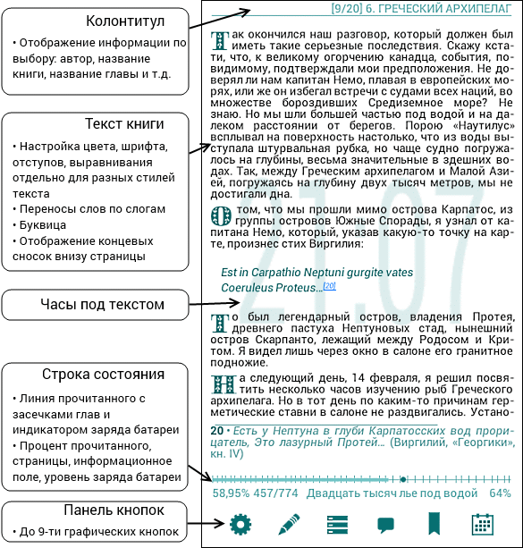
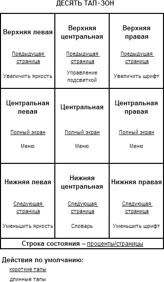
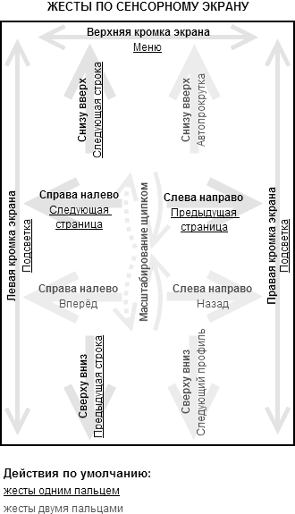

% Справка для программы AlReader (Android)
% olimo, Jitakusu, Keldi
% 2014-11-25

*AlReader – универсальная читалка для Android с поддержкой форматов fb2,
fbz, txt, epub (без DRM), html, doc, docx, odt, rtf, mobi (в том числе с
высокой степенью компрессии (HUFF/CDIC)), prc (PalmDoc), tcr. Поддержка
открытия книг из ZIP и GZ архивов.*

This User Guide is available only in Russian now. If you would like to
be a volunteer to translate it into your native language (or make
localization of AlReader interface), please get in touch with Alan (look
for e-mail in AlReader-Menu-File-Info-About).

Данное руководство пользователя приведено в соответствие с версией
AlReader-Debug 1.551124 (141124). Последние изменения вносились
25 ноября 2014 года.

Если Вам встретятся опечатки, ошибки или неточности, либо если у Вас
есть замечания или дополнения к данной справке, пожалуйста, напишите о
них в личном сообщении к
[Keldi](http://4pda.ru/forum/index.php?showuser=1064270) на форуме
[4pda.ru](http://4pda.ru/forum/) либо в электронном письме на
адрес <alreader-help@mail.ru>.

# Оглавление

1.  [Элементы окна программы](#elements)
2.  [Основные функции программы](#program_functions)
    1.  [Режим чтения и навигация по книге](#reading)
        -   [Листание](#scroll)
        -   [Автопрокрутка](#autoscroll)
        -   [Чтение вслух (TTS)](#tts)
        -   [Переходы по книге](#goto)
        -   [Содержание книги](#contents)
        -   [Гиперссылки, сноски, переходы назад и вперёд](#hyperlinks)
        -   [Поиск по книге](#search)

    2.  [Открытие и упорядочивание книг](#openbook)
        -   [Встроенный файловый менеджер](#filemanager)
        -   [Последние открытые](#last_opened)
        -   [Избранное](#favorite)
        -   [Библиотека](#library)
        -   [Синонимы авторов](#aliase)
        -   [Сетевые библиотеки (OPDS)](#OPDS)

    3.  [Режим выделения](#selection)
    4.  [Маркеры](#markers)
    5.  [Закладки](#bookmarks)
    6.  [Цитаты](#cites)
    7.  [Отправка в словарь](#dictionary)
    8.  [Режим редактирования](#editing)
    9.  [Синхронизация позиции чтения между Android-устройствами](#sync)
    10. [Online топ-100 авторов и книг](#top100)
    11. [Адаптация для E-ink экранов](#eink)
    12. [Ярлыки для книг на домашний экран Android](#shortcuts)
    13. [Пользовательские профили](#profiles)
    14. [Сохранение и восстановление пользовательских настроек](#save_load)
3.  [Описание меню и действий](#menu_description)
    1.  [Главное меню](#menu)
        -   [Открыть книгу](#open_book_menu)
        -   [Быстрые настройки](#quick_tunes_menu)
        -   [Переход](#go_to)
        -   [Действия](#actions)
        -   [Настройки](#settings_menu)
        -   [Файл](#file)

    2.  [Выбор действия (меню для BACK)](#back_menu)
    3.  [Перечень действий для тапов, жестов, кнопок](#list_of_actions)

4.  [Настройки программы](#settings)
    1.  [Основные](#main_settings)
    2.  [Экран](#display_settings)
        -   [Настройка анимации листания](#animation)
        -   [Настройка автопрокрутки](#autoscroll_settings)
        -   [Полноэкранный и оконный режим](#screen)
        -   [Колонтитул](#header_settings)
        -   [Строка состояния](#statusbar_settings)
        -   [Линия прочитанного](#progressbar_settings)
        -   [Панель кнопок](#toolbar_settings)

    3.  [Шрифты](#fonts)
    4.  [Текущий профиль](#current_profile)
        -   [Цвета](#colors)
        -   [Отступы](#margins)
        -   [Свойства профиля](#profile_properties)
        -   [Часы](#clock)

    5.  [Стили](#styles)
    6.  [Тап-зоны, жесты и кнопки](#tap)
    7.  [Подсветка](#backlight)
    8.  [Настройки библиотеки](#library_settings)
    9.  [Объединение профилей](#combining)
    10. [Синхронизация позиции чтения](#sync_settings)
    11. [Тонкая настройка](#tuning)
    12. [Вид настроек](#settings_view)
    13. [Действия с книгой](#book_operations)

5.  [Список изменений программы](#changelog)
6.  [Об авторах и принявших участие](#autors)
7.  [Ссылки](#links)

#Элементы окна программы

Окно программы AlReader включает следующие элементы:

-   Собственно **текст открытой книги**.
-   **[Колонтитул](#header_settings)**. В колонтитуле по выбору
    пользователя может отображаться имя файла, автор, название книги,
    заголовок главы или раздела книги, в том числе вместе с количеством
    страниц в них. Если формат книги не позволяет узнать необходимую
    информацию, в колонтитуле отображается только имя файла.
-   **[Строка состояния](#statusbar_settings)** — это строка под
    текстом, в которой могут отображаться процент прочитанного, номер
    текущей страницы и количество страниц в книге, время, заряд батареи,
    [линия прочитанного](#progressbar_settings), а также информация,
    аналогичная отображаемой в колонтитуле.
-   **Часы под текстом** – под текстом изображены крупные неяркие
    цифровые часы, отображающие текущее время. При необходимости можно
    настроить [цвет](#colors) часов или [отключить](#clock) их.
-   **[Панель кнопок](#toolbar_settings)** (графическое меню) – панель с
    кнопками для определённых [действий](#list_of_actions). По умолчанию
    не показывается.

Отображение тех или иных элементов настраивается отдельно для
[полноэкранного и оконного режима](#screen) программы. По умолчанию в
полноэкранном режиме видны только текст и линия прочитанного (для
устройств с Android 3+ при отсутствии аппаратных кнопок возможно
сохранение полосы кнопок в нижней части экрана). Переключение в
полноэкранный режим и обратно осуществляется нажатием на центральную
кнопку джойстика, тапом по центру экрана (можно изменить в [настройках
кнопок, тапов, жестов](#tap)).

# Основные функции программы {#program_functions}

## Режим чтения и навигация по книге {#reading}

**Режим чтения** – основной режим работы программы – активируется при
включении AlReader.

Листать страницы можно с помощью тапов (прикосновений к сенсорному
экрану), жестов (проведение линий на сенсорном экране), аппаратных
кнопок устройства. Действия для всех [кнопок, тапов и жестов](#tap)
могут быть переназначены в соответствующих настройках. Кроме того,
кнопки листания страниц можно добавить на [панель
кнопок](#toolbar_settings).

**Листание** может осуществляться:

-   **постранично** (по умолчанию: следующая/предыдущая страница – тап в
    нижней/верхней зоне экрана, кнопка вниз/вверх на джойстике);
-   **построчно** (по умолчанию: следующая строка – жест снизу вверх по
    экрану, кнопка влево на джойстике; предыдущая строка – жест сверху
    вниз по экрану, кнопка вправо на джойстике; жестами вверх/вниз можно
    «перетягивать» текст сразу на несколько строк).

В настройках можно включить **[анимацию листания страниц](#animation)**.

**Автопрокрутка** позволяет не листать страницы книги вручную:

-   Автопрокрутка включается в *Меню – Действия – Автопрокрутка* (её
    вызов можно также назначить на [кнопку устройства, тап или
    жест](#tap)).
-   Один из трёх [типов автопрокрутки](#autoscroll_settings) можно
    выбрать в настройках экрана.
-   При включённой автопрокрутке её скорость можно регулировать в режиме
    реального времени: кнопка, тап, жест, на который назначено действие
    «Следующая страница», увеличивает скорость автопрокрутки,
    «Предыдущая страница» – уменьшает скорость автопрокрутки.
-   Кнопка, тап или жест, на который назначено действие «Полный экран»
    (по умолчанию это центральная кнопка, тап по центральной зоне
    экрана) ставит автопрокрутку на паузу (снимает с паузы).
-   Для остановки автопрокрутки следует нажать кнопку BACK.
-   По умолчанию при включённой автопрокрутке AlReader реагирует только
    на вышеупомянутые действия (предыдущая/следующая страница, полный
    экран и BACK). Однако можно установить в [тонких
    настройках](#autoscroll_commands) галочку «Команды при
    автопрокрутке», тогда все остальные действия тоже будут выполняться,
    предварительно остановив автопрокрутку.

Для **воспроизведения книг вслух** возможно использование
**Text-to-speech** (**TTS**, Текст в речь, технология синтеза речи):

-   **Внимание!** Для работы функции «Текст в речь» необходимо, чтобы в
    системе был установлен и выбран в настройках синтезатор c голосом
    для нужного языка. При выборе *Настройки Android – Язык и ввод –
    Синтез речи – Прослушать пример* (названия и расположение пунктов
    меню могут отличаться) должен звучать текст на том же языке, книгу
    на котором вы хотите озвучить.
-   Озвучивание книги можно включить в меню (*Меню – Действия – Текст в
    речь*) или назначив соответствующее действие на [тап, кнопку или
    жест](#tap). После включения TTS начнётся воспроизведение текста,
    озвучиваемый фрагмент будет выделяться цветом в соответствии с
    настройкой *Цвета – Выделенный текст*. Если текст выделяется, но
    чтения вслух не происходит, проверьте наличие в системе голоса
    нужного языка и его настройки. Если чтение вслух происходит только
    при наличии Интернет-соединения, значит, установлен голосовой
    движок, работающий только online.
-   При включённом TTS на экране отображается панель управления со
    следующими кнопками: Воспроизведение/Пауза, Остановка TTS,
    Увеличение скорости, Уменьшение скорости, Увеличение громкости,
    Уменьшение громкости.
-   Поставить на паузу и возобновить чтение можно с гарнитуры (при
    наличии на гарнитуре media-кнопок Play/Pause; при наличии на
    гарнитуре дополнительных кнопок возможно регулирование громкости и
    скорости TTS). Для однокнопочных гарнитур, как правило, доступна
    только остановка TTS.
-   Качество озвучивания зависит от синтезатора речи, AlReader только
    отправляет текст книги соответствующему приложению.

**Переход** (*Меню – Переход* и действия, назначаемые на [тап, кнопку
или жест](#tap)), дают возможность осуществлять быстрое перемещение по
книге:

-   переход **в начало** или **в конец книги;**
-   переход **на 10 страниц вперёд или назад** – в данном случае имеются
    в виду «экранные страницы» (фрагмент текста, умещающийся на экране),
    которые могут не совпадать с данными счётчика страниц в строке
    состояния/колонтитуле (см. [Размер страницы](#page));
-   переход **по процентам/страницам** – переход в указанное место файла
    (в процентах от начала) либо переход на указанную страницу файла.
    Можно вводить значение с клавиатуры либо использовать слайдер.
    (Примечание: по умолчанию страницы **не** экранные, а равные
    определённому объёму текста в символах. Подробнее см. [Размер
    страницы](#page)).
-   для форматов, поддерживающих заголовки, доступно **содержание
    книги**. Открыть его можно в *Меню – Переход – Содержание* или
    назначив действие «Содержание» для [кнопки, тапа, жеста](#tap) или
    на [панель кнопок](#toolbar_settings). В содержании перечисляются
    названия глав и разделов книги. Пункт содержания, соответствующий
    текущему положению в книге, выделяется жирным шрифтом и
    подчёркиванием. Для каждого пункта содержания указывается число
    страниц в книге до следующего пункта (слева), а также процент и
    номер страницы от начала книги (справа). Для быстрого перехода по
    главам можно назначить действия **Предыдущая глава** и **Следующая
    глава** на [кнопку, тап или жест](#tap). Возможно включить
    отображение подзаголовков в содержании в *Меню – Настройки –
    Изменить свойства формата – Подзаголовки в содержании*. Если книга
    содержит заголовки разных уровней, возможно сворачивание и
    разворачивание отдельных пунктов нажатием на минус и плюс рядом с
    ними, а также доступны действия «Свернуть все» и «Развернуть все».
    Содержание отображается системным шрифтом (у разных версий Android,
    прошивок устройств шрифты могут отличаться): если в системном шрифте
    отсутствует какой-либо символ (например, знак ударения), то и в
    содержании он правильно отображён не будет.
-   Перемещение по **гиперссылкам** (включая сноски, однако можно
    включить отображение сносок внизу страницы и просматривать их без
    перехода по ссылкам) в AlReader может выполняться с помощью коротких
    или длинных тапов по ним (согласно [настройке](#tap)).\
     Для возврата назад выберите «Назад» (*Меню – Переход – Назад*, меню
    выбора действия по *BACK – Назад*, либо кнопка, тап, жест с
    предварительно назначенным действием «Назад»). Действие **«Назад»**
    означает переход к последней сохранённой позиции (стек переходов
    сохраняет несколько позиций в пределах открытой книги; позиция
    сохраняется при открытии любого диалогового окна, например, меню
    настроек; стек сбрасывается при закрытии программы, при сворачивании
    стек сохраняется). Действие **«Вперёд»** позволяет перейти к
    следующей сохранённой позиции (на данном этапе работает только после
    команды назад).\
     Подробнее про **отображение текста сносок** см. в
    [Настройках](#footnotes_settings).
-   **Поиск** (*Меню – Файл – Поиск* либо *действие «Поиск»*,
    назначенное на [кнопку, тап или жест.](#tap)) предназначен для
    нахождения в книге слова, фразы или предложения.\
     Фраза для поиска должна быть не короче двух символов, не считая
    пробелов. Кроме того, допустимо использовать символ **?** для замены
    одного произвольного символа в поисковой фразе (например, при поиске
    «т??ст » могут быть найдены «текст », «траст », «твист »). Длина
    фразы для поиска не должна быть более 31 символа. Поиск не
    чувствителен к регистру.\
     В диалоге поиска по нажатию на «Поиск» происходит переход в книге к
    совпадению текста с поисковым запросом (при его наличии начиная с
    открытой страницы и до достижения конца книги), повторное нажатие на
    «Поиск» перелистывает книгу к следующему совпадению. Опция «Искать с
    начала файла» позволяет вести поиск с начала файла, а не с текущей
    страницы книги.
-   Отмечать в книге определённые места для последующего быстрого их
    нахождения можно с помощью **[закладок](#bookmarks)**.

## Открытие и упорядочивание книг

Открыть книгу в AlReader можно с помощью [встроенного файлового
менеджера](#filemanager) (или из файлового менеджера Android'a, выбрав
при открытии файла с книгой AlReader), а также скачав из [сетевой
библиотеки](#OPDS) (каталога OPDS). Если книга уже открывалась ранее, её
можно найти в списке [«Последние открытые»](#last_opened). Книги можно
добавлять в список [«Избранное»](#favorite) для их быстрого нахождения в
будущем. В программе имеется встроенный каталогизатор –
[Библиотека](#library) – позволяющий видеть книги с карты памяти
устройства сгруппированными по автору, названию, серии.

Библиотека, Встроенный файловый менеджер, Сетевые библиотеки, Последние
открытые и Избранное поддерживают **отображение книг в несколько
колонок** (**многоколоночный режим**) и с **книжными полками**.
Переключить вид можно, нажав на иконку (глаз) в заголовке одного из этих
диалогов и выбрав нужный вариант:

-   Автоширина (стандартная) – автоматический выбор количества колонок
    исходя из размера экрана.
-   Одна колонка
-   Две колонки
-   Автоширина (Wide) – автоматический выбор количества колонок (более
    широких, чем при стандартной автоширине).
-   Показывать полку – включение и отключение отображения фоновой
    картинки в виде **книжной полки**. Фон книжной полки может быть
    заменён на пользовательский: для этого следует положить файл
    (изготовленный по аналогии со скинами – инструкция доступна на
    форуме
    [4pda.ru](http://4pda.ru/forum/index.php?s=&showtopic=347421&view=findpost&p=13619480))
    с именем *bookshelf.9.png* в папку AlReader на [карте
    памяти](#scard).
-   Скрыть авторов и названия – (доступно во встроенном файловом
    менеджере и в списке последних открытых книг) включение и отключение
    отображения строки с именем автора и названием для книг в форматах
    fb2, epub и mobi.

В [настройках библиотеки](#library_settings) можно включать/отключать
отображение, менять размер обложек книг (эта настройка повлияет на все
списки с книгами).

Помимо этого, на диалоги со списками книг действуют некоторые настройки
[внешнего вида меню и диалогов](#menu_description): фоновая текстура,
размер и ширина символов шрифта, тёмный либо белый интерфейс, цвет
иконок.

### Встроенный файловый менеджер

Чтобы открыть файл с помощью встроенного в программу файлового
менеджера, можно воспользоваться меню (*Меню – Открыть книгу – Открыть
файл* или меню по кнопке BACK *Открыть книгу – Открыть файл*) либо
назначить действие «Открыть файл» [на тап, кнопку или жест](#tap).

В меню открытия файла отображается папка текущего открытого файла (при
первом запуске программы – корневая папка устройства, в этом случае
необходимо проследовать по пути /mnt/sdcard/\<Папка с книгами\> (путь к
карте памяти может быть другим в зависимости от конкретного
устройства)).

В файловом менеджере показываются файлы только тех типов, которые могут
быть открыты в программе (В папке с несколькими тысячами книг возможно
отображение не всего списка файлов, а только его начала).

В верхней строке показывается текущий путь, иконка со стрелкой справа
служит для перехода на один уровень каталогов вверх, при нажатии на
кнопку BACK происходит выход из файлового менеджера. (В [настройках
библиотеки](#library_settings) можно выбрать иную реакцию программы на
эту кнопку: при её нажатии будет происходить переход на уровень выше в
дереве папок, а при нажатии BACK в корневом каталоге устройства – выход
из файлового менеджера; вместо стрелки в этом случае вверху будет
крестик для закрытия диалога).

Текущая книга (и содержащие её папки на всем пути до корневого каталога)
выделяется в файловом менеджере жирным шрифтом и подчёркиванием.

Если папка содержит книги, которые ранее открывались в AlReader, для них
будет показан процент, на котором была открыта последняя читаемая из
этой папки книга и время её открытия.

Файлы и папки можно сортировать (*Меню – Сортировка*) по имени, по дате
(по убыванию и возрастанию) и по размеру (по убыванию и возрастанию).

В списке для файлов книг указываются:

-   название файла с расширением;
-   формат файла;
-   дата создания файла;
-   процент прочитанного и дата последнего сохранения позиции чтения в
    файле (если файл открывался в программе ранее);
-   обложка для форматов файлов, поддерживающих обложки;
-   год, автор и название книги, если файл книги содержит данную
    информацию.

Тап по файлу (папке) приводит к его (её) открытию. По длинному тапу
открывается меню «Действия», позволяющее:

-   удалить файл (но нельзя удалить открытый в данный момент в программе
    файл) или папку (за исключением случая, когда она пустая). Удаление
    с карты памяти, доступной только для чтения (системное ограничение
    Android 4.4 KitKat) не работает.
-   посмотреть свойства файла. В свойствах файла (если эта информация
    доступна) отображается обложка книги, название, авторы, язык, год,
    серия и жанры, аннотация, путь к файлу. Тап по обложке либо по
    иконке с книгой в заголовке окна приводит к открытию книги. Тап по
    стрелочке в заголовке окна либо нажатие кнопки BACK возвращает в
    файловый менеджер. Нажатие кнопки Меню даёт возможность добавить
    книгу в [Избранное](#favorite).

Внешний вид встроенного файлового менеджера зависит от системных
настроек, так как программа использует стандартные меню и стандартный
диалог настроек Android. Однако AlReader поддерживает отображение
списков в [многоколоночном режиме и установку фонов (книжных
полок)](#dialog_view). В [настройках библиотеки](#library_settings)
можно включать/отключать отображение, менять размер обложек книг (по
умолчанию включено только для Android 4+). В режиме [расширенных
настроек](#settings_view) можно [изменить](#menu_tuning) величину шрифта
и цвет иконок для папок и файлов в списке.

### Последние открытые

Последние открытые – список последних открытых в AlReader файлов (размер
списка ограничен 256 книгами). Перейти к данному списку можно из меню
(*Меню – Открыть книгу – Последние открытые* или меню по кнопке BACK
*Открыть книгу – Последние открытые*) либо назначив соответствующее
действие для [тапа, кнопки или жеста](#tap).

Внешний вид и действия аналогичны таковым во [встроенном файловом
менеджере](#link_for_last_opened) со следующими отличиями:

-   пункт «Удалить» служит для удаления книги только из списка последних
    открытых, а не файла книги с устройства;
-   очистить список можно, нажав кнопку меню и выбрав действие «Удалить
    все»;
-   в меню добавлен пункт «Убрать удалённые» (значок с корзиной в
    заголовке окна). Удаление файла книги с устройства не приводит
    автоматически к удалению книги из списка последних открытых (такие
    книги помечаются в списке значком со знаком вопроса). Данный пункт
    меню позволяет убрать сразу все «несуществующие» книги из списка.

### Избранное

Пользовательский список избранных книг. Внешний вид и действия такие же,
как во встроенном [файловом менеджере](#link_for_last_opened) и [списке
последних открытых](#last_opened) книг.

Добавить книгу в Избранное можно одним из следующих способов:

-   во [встроенном файловом менеджере](#filemanager) – *Длинный тап по
    книге – Свойства файла – Меню – В избранное*;
-   в списке [последних открытых](#last_opened) – *Длинный тап по
    книге – Свойства файла – Меню – В избранное*;
-   из открытой книги – *Меню – Действия – Добавить – В избранное*;
-   назначив действие «В избранное» для [тапа, кнопки или жеста.](#tap)

Попасть в список Избранное можно:

-   через *Меню – Открыть книгу – Избранное*;
-   меню по кнопке BACK *Открыть книгу – Избранное*;
-   назначив действие «Избранное» для [тапа, кнопки или жеста.](#tap)

Удалять книги из данного списка можно:

-   одну книгу – находясь в списке Избранного длинным тапом нажать на
    книгу и выбрать «Удалить»;
-   все книги – находясь в списке Избранного нажать Меню и выбрать
    «Удалить все»;
-   книги, файлы которых удалены с устройства – находясь в списке
    Избранного выбрать пункт «Убрать удалённые» (иконка корзины в
    заголовке окна).

В Избранном книги сортируются по времени добавления: книги, добавленные
в избранное позже, в списке будут выше.

Информация о книгах, находящихся в Избранном, хранится вместе с
[закладками](#bookmarks) в файле *favorAR.db* в каталоге *AlReader* по
пути, указанному для [карты памяти](#scard). Этот файл (база SQLite)
содержит пути к книгам, поэтому простое копирование файла на другое
устройство не сработает для переноса закладок и избранного, если там
пути к книгам окажутся другими.

### Библиотека

Библиотека позволяет создать **каталог файлов в форматах fb2, epub и
mobi** (включая книги, находящиеся в zip-архивах), в котором книги
отображаются по авторам, жанрам, сериям.

Благодаря этой функции (особенно с использованием [синонимов
авторов](#aliase)) можно не тратить время на упорядочивание книг по
папкам и переименование файлов.

Попасть в Библиотеку можно:

-   через *Меню – Открыть книгу – Библиотека*;
-   меню по кнопке BACK *Открыть книгу – Библиотека*;
-   назначив действие Библиотека для [тапа, кнопки или жеста.](#tap)

При первом открытии Библиотеки потребуется **просканировать** карту
памяти для добавления книг в каталог. Путь к карте памяти (либо папке с
книгами) можно указать в [настройках библиотеки](#library_settings) либо
во встроенном файловом менеджере сделать долгий тап на нужную папку и
выбрать «Установить путь к библиотеке». В каталог будут добавлены книги,
находящиеся как в корне указанной папки, так и в подкаталогах различной
степени вложенности. Если Вы хотите, чтобы книги из некоторых папок не
добавлялись в каталог библиотеки, следует создать в таких папках файл с
именем *.nomedia* и поставить соответствующую галочку в [настройках
библиотеки.](#library_settings)

Обычно сканирование занимает менее минуты для тысячи файлов, но в
зависимости от устройства продолжительность сканирования может быть
иной. При добавлении или удалении книг на устройство для обновления
библиотеки необходимо выполнить сканирование заново, выбрав пункт
«Сканировать» в Библиотеке. В заголовке стартового экрана библиотеки
указывается дата и время, когда производилось последнее сканирование.

После завершения сканирования файлов в системном оповещении будет
указано:

-   сколько книг занесено в библиотеку;
-   число пройденных при сканировании файлов (может отличаться от числа
    книг: в меньшую сторону, если несколько книг содержатся в одном
    файле-архиве; в большую сторону, если помимо книг в форматах fb2,
    epub и mobi в выбранной для сканирования папке находятся и другие
    файлы);
-   время сканирования в секундах.

В Библиотеке **книги группируются по авторам, сериям и названиям** (для
каждой группы указывается количество элементов в ней). Внутри этих групп
элементы сортируются по алфавиту (в сериях книги сортируются по номеру в
серии), для авторов и серий указывается количество у них книг. Элементы,
начинающиеся с цифр и «без названия» располагаются в конце списка.
Возможно включение опции для расположения названий на кириллице в начале
списка. Возможно отключение учёта артиклей в английских названиях книг и
серий.

На главном экране библиотеки можно установить **фильтр по языку, жанру,
тексту, дате публикации книги и дате создания файла.**

-   После установки фильтра в группах «По авторам», «По сериям», «По
    названиям» будут присутствовать только книги, соответствующие
    параметрам фильтрации.
-   Фильтр «Текст» даёт возможность осуществить фильтрацию по части
    названия, имени автора или части названия серии. Для отбора книг
    необходимо ввести в фильтр как минимум две буквы. Если введённый
    текст содержится в имени элемента (названии книги или серии, имени
    автора), то отобранными окажутся этот элемент и все связанные с ним
    элементы: например, если искомый текст содержится в названии серии,
    то после фильтрации в группе «По сериям» будет отображаться данная
    серия, в группе «По авторам» – авторы книг из данной серии, в группе
    «По названиям» – все книги из этой серии (хотя имена авторов и
    названия книг могут и не содержать искомого текста).
-   Для сброса фильтрации в меню фильтров есть пункт «Очистить все
    фильтры». Для сброса только одного из нескольких выбранных фильтров
    необходимо зайти в соответствующий фильтр и выбрать «Не фильтровать»
    (и/или стереть всё в фильтре «Текст»).

При большом количестве элементы в авторах, сериях и названиях
дополнительно группируются по первой букве названия (возможно включить
принудительную группировку по первой букве для всех списков). В
остальном внешний вид списков в библиотеке аналогичен таковому во
[встроенном файловом менеджере](#link_for_last_opened).

**По короткому тапу** происходит открытие соответствующего списка, при
тапе по книге открываются диалог [Свойства книги](#properties). Для
возвращения на уровень выше в списке необходимо нажать на стрелочку
вверху списка либо выбрать в настройках библиотеки опцию перехода на
уровень вверх для кнопки BACK.

**По длинному тапу**:

-   по серии в группе «По авторам» открывается меню, с помощью которого
    можно осуществить переход к одному из авторов этой серии либо к
    самой серии в группе «По сериям»;
-   по книге в группе «По авторам» – переход к серии в группе «По
    сериям»;
-   по серии в группе «По сериям» – переход к одному из авторов этой
    серии в группе «По авторам»;
-   по книге в группе «По сериям» – переход к одному из авторов этой
    книги в группе «По авторам»;
-   по книге в группе «По названиям» – переход к одному из авторов этой
    книги в группе «По авторам» либо к серии в группе «По сериям».

Кроме пункта «Перейти к…», по длинному тапу по книге в меню содержатся
ещё следующие элементы:

-   **Читать** – открытие книги для чтения;
-   **Свойства** – отображение информации о книге, подробнее
    [здесь](#properties).
-   **Удалить** – удаление файла книги с устройства; если книга
    расположена в архиве, удалится весь архив со всеми находящимися в
    нём файлами. Удаление с карты памяти, доступной только для чтения
    (системное ограничение Android 4.4 KitKat) не работает.

Выход из библиотеки может осуществляться с открытием книги, нажатием на
крестик в заголовке окна либо по кнопке BACK (если для данной кнопки не
выбрано иное поведение в настройках библиотеки). При следующем открытии
библиотека откроется на том же списке, на котором она была закрыта (если
иное не установлено в настройках библиотеки).

**Внешний вид** диалога библиотеки [изменяется аналогично](#openbook)
другим диалогам со списками книг.

Каталог библиотеки хранится в файле *catalogAR.db* в каталоге *AlReader*
по пути, указанному для [карты памяти](#scard). Этот файл (база SQLite)
содержит пути к книгам, поэтому простое копирование файла на другое
устройство не сработает для переноса каталога библиотеки, если там пути
к книгам окажутся другими.

#### Синонимы авторов

Библиотека позволяет **объединять одних и тех же авторов, указанных в
книгах по-разному**, с помощью файла синонимов. Этот файл должен иметь
имя *aliases.utf8.txt* и находиться в каталоге *AlReader* на [карте
памяти](#scard) устройства. После добавления или изменения файла
синонимов необходимо повторить сканирование библиотеки.

Синонимы учитываются только при сканировании, в окошке свойств книги
автор будет показан так, как занесено в файл книги.

Вместе с программой поставляется файл синонимов для книг на русском
языке (на Android 4+ он автоматически копируется в нужную папку, если в
системе или в самом AlReader'e выбран русский язык. Для предыдущих
версий Android можно скачать данный файл на [форуме
4pda](http://4pda.ru/forum/index.php?s=&showtopic=340035&view=findpost&p=27927282)).
Можно использовать данный файл, редактируя его при необходимости, либо
создать свой файл синонимов (если создан пользовательский файл
синонимов, AlReader не будет заменять его на поставляемый файл).

**Пример файла aliase.utf8.txt:**

    ПУШКИН А С=Пушкин Александр Сергеевич
    АЛЕКСАНДР ПУШКИН=Пушкин Александр Сергеевич
    НЕТ АВТОРА=*

**Пояснения по содержимому файла aliase.utf8.txt:**

-   Каждое приравнивание синонимов следует писать **с новой строки**.
-   **Перед знаком равно («=»)**:
    -   содержится вариант записи имени автора, который не должен
        показываться в библиотеке;
    -   текст должен быть либо полностью написан заглавными буквами:

            ПУШКИН А=Пушкин Александр Сергеевич
            ПУШКИН АЛЕКСАНДР=Пушкин Александр Сергеевич

        либо каждое слово с заглавной буквы:

            Пушкин А=Пушкин Александр Сергеевич
            Пушкин Александр=Пушкин Александр Сергеевич

    -   не обязательно создавать отдельные строки для всех вариантов
        написания имени автора, если они различаются только
        наличием/отсутствием точки и запятой, лишними пробелами: при
        сравнении имени автора со строкой в файле *aliase.utf8.txt*
        AlReader заменяет точки и запятые на пробелы, а «лишние» пробелы
        (двойные, тройные, в конце имени) убирает.

        Таким образом, вместо множества строк:

            ПУШКИН А. С.=Пушкин Александр Сергеевич
            ПУШКИН А С=Пушкин Александр Сергеевич
            ПУШКИН А.С=Пушкин Александр Сергеевич
            ПУШКИН А, С,=Пушкин Александр Сергеевич
            ПУШКИН А. С,=Пушкин Александр Сергеевич
            ПУШКИН А,С,=Пушкин Александр Сергеевич

        и т. д.

        достаточно указать в файле *aliase.utf8.txt* одну строку:

            ПУШКИН А С=Пушкин Александр Сергеевич

-   **После знака равно («=»)**:
    -   указывается вариант написания имени автора, который следует
        отображать в библиотеке;
    -   текст должен быть написан с учётом регистра так, как он должен
        отображаться в библиотеке без установки в настройках галочки
        «Использовать верхний регистр»:

        *СААДИ МУСЛИХИДДИН=Саади Муслихиддин ибн Юсуф*

    -   для указания, что автор книги неизвестен либо для исключения
        «лишнего автора» следует использовать знак звёздочки («\*»):

            НЕТ АВТОРА=*
            НЕ УКАЗАН=*
            НЕУСТАНОВЛЕННЫЙ АВТОР=*
            РЕДАКТОР-ФАЙЛА-ОШИБОЧНО-В-АВТОРЫ-ЗАПИСАННЫЙ=*

        Если у книги будет один автор, приравненный к «звёздочке», в
        библиотеке она будет в группе «без автора». Если помимо авторов,
        приравненных к «звёздочке», у книги есть и другие авторы – книга
        будет отображена в группе «без автора» и у других её авторов.

### Сетевые библиотеки (OPDS)

Функция «Сетевые библиотеки» позволяет скачивать книги из каталогов
*OPDS* (англ. *Open Publication Distribution System*).

**Зайти в «Сетевые библиотеки»** можно:

-   через *Меню – Открыть книгу – Сетевые библиотеки*;
-   через меню по кнопке BACK *Открыть книгу – Сетевые библиотеки*;
-   с помощью [тапа, кнопки или жеста](#tap) с действием «Сетевые
    библиотеки».

Для **добавления нового каталога** выберите «Добавить каталог» и в
открывшемся диалоге:

-   укажите адрес каталога (будьте внимательны: адрес сайта электронной
    библиотеки не то же самое, что адрес OPDS-каталога этой библиотеки);
-   если для пользования OPDS-каталогом требуется авторизация, в
    следующем поле введите свои логин и пароль через двоеточие
    (*ваш\_логин:ваш\_пароль*), иначе оставьте поле пустым.
-   если соединение с Интернетом осуществляется через proxy, укажите IP
    и порт прокси-сервера, иначе оставьте поле пустым.\
     В качестве proxy-сервера возможно использование приложения
    [Orbot](https://guardianproject.info/apps/orbot/) (клиент Tor для
    Android), наличие root-прав не обязательно (Orbot должен быть
    включён, в AlReader'е для каталога указывается прокси
    127.0.0.1:8118).

Имеющийся каталог можно **отредактировать, переименовать или удалить**,
вызвав меню длинным тапом по этому каталогу и выбрав соответствующее
действие.

По короткому тапу происходит **открытие** добавленного сетевого
каталога, списка внутри каталога, диалога [Свойства книги](#OPDS_properties).

Для **возврата на уровень** выше служит верхний пункт с иконкой-стрелкой
в списках (и аналогичная иконка в заголовке окна).

Для **возвращения к стартовому экрану** Сетевых библиотек можно выбрать
пункт «Выйти из библиотеки»:

-   в списке действий, вызываемом длинным тапом по верхнему пункту в
    списках (с иконкой-стрелкой);
-   в списке действий при открытии Меню.

**Для закрытия** диалога Сетевых библиотек можно:

-   нажать на кнопку BACK (В [настройках библиотеки](#library_settings)
    можно выбрать иную реакцию программы на кнопку BACK: при её нажатии
    будет происходить переход на уровень выше в сетевом каталоге, а при
    нажатии BACK в корневом каталоге библиотеки – выход из Сетевой
    библиотеки; вместо стрелки вверху окна в этом случае будет крестик
    для закрытия диалога).;
-   выбрать в списке действий в Меню «Открыть книгу» – это возвращение к
    читаемой в программе книге;
-   открыть скачанную книгу для чтения (см. ниже).

**Свойства книги** – диалог, содержащий информацию о ней (название,
авторы, жанр, серия, аннотация, язык, обложка, формат и размер файла и
т. д.). Он открывается по короткому тапу по книге в списке либо по
длинному тапу при выборе пункта «Свойства». Из этого диалога можно:

-   скачать книгу и сразу открыть её в читалке – тап по обложке книги
    или по иконке книги в заголовке окна (диалог сетевой библиотеки при
    этом будет закрыт);
-   скачать книгу без её открытия – *Меню – Скачать книгу* (диалог
    сетевой библиотеки закрыт не будет);
-   вернуться обратно к списку книг в сетевой библиотеке (иконка со
    стрелочкой в заголовке диалога либо кнопка BACK).

Для **скачивания книги без просмотра её свойств** следует сделать
длинный тап по книге в списке и выбрать пункт:

-   Читать – скачивание книги и открытие её в читалке, диалог сетевой
    библиотеки при этом закрывается;
-   Скачать книгу – скачивание книги на устройство без её открытия (и
    без закрытия сетевой библиотеки).

**Закладки** предназначены для быстрого открытия в OPDS-каталоге
страницы с книгами какого-либо автора, жанра, серии или запроса в
поиске. Чтобы создать закладку, следует, находясь на интересующей
странице:

-   зайти в Меню и выбрать пункт «Добавить закладку» *либо*
-   сделать длинный тап по верхнему пункту в списке с иконкой-стрелкой и
    выбрать пункт «Добавить закладку».

Сохранённые закладки отображаются ниже остальных ссылок в корне того
OPDS-каталога, к которому они относятся. Закладку можно переименовать
либо удалить, вызвав меню длинным тапом по этой закладке и выбрав
соответствующее действие.

**Папкой для загрузки** книг по умолчанию является каталог *download* на
[карте памяти](#scard) устройства (при скачивании книга сохраняется в
подкаталог *\<Автор\_книги\>*, а именем файла будет название книги). Для
выбора другой папки, куда будут сохраняться книги, следует открыть
встроенный файловый менеджер (*Меню – Открыть книгу – Открыть файл*),
сделать долгий тап по нужной папке и выбрать пункт «Использовать для
закачек».

**История закачек** в корневом диалоге сетевых библиотек содержит список
всех скаченных книг. В этом списке:

-   длинным тапом по книге вызывается меню с действиями:
    -   Читать – открытие скаченной книги;
    -   Свойства – диалог с [информацией о книге](#properties);
    -   Удалить – удаление книги из списка, файл книги не удаляется.
-   при нажатии кнопки Меню доступны действия:
    -   Открыть книгу – возврат к текущей открытой в программе книге
        (закрытие диалога Сетевых библиотек);
    -   Убрать удаленные – очистка списка от книг, файлы которых были
        удалены с устройства.

**Внешний вид** диалога сетевые библиотеки [изменяется
аналогично](#openbook) другим диалогам со списками книг.

## Режим выделения

Режим выделения позволяет выделить текст для выполнения одного из
следующих действий:

-   сохранения [цитаты](#cites) в текстовый файл;
-   добавление [закладки](#bookmarks);
-   выделения текста [маркером](#markers);
-   отправки текста в [словарь](#dictionary);
-   вызова меню Android'а «Отправить»;
-   копирования текста в буфер обмена;
-   перехода в [режим редактирования](#editing).

Режим выделения активируется:

-   через *Меню – Действия – Выделить всё*;
-   длинным тапом, если установлен [Режим выделения для длинных
    тапов](#tap);
-   [тапом, жестом, кнопкой](#tap), на который(-ую) назначено действие
    «Выделить всё».

При активации режима выделения выделенной оказывается вся видимая на
экране страница. Выделить несколько страниц подряд нельзя. Если
необходимый текст не помещается на экран, возможно, нужный кусок текста
удастся поместить на страницу, перелистывая текст [построчно](#scroll)
либо уменьшив размер шрифта.

Текст выделяется пословно, выделение части слова AlReader не
поддерживает – только целые слова. Для выделения одного слова достаточно
тапнуть по нему. Чтобы выделить фрагмент текста, необходимо прикоснуться
к первому слову нужного отрывка и провести пальцем по экрану вниз до
последнего слова.

После выбора нужного фрагмента текста нажатием на красную иконку в
правой нижней области экрана можно вызвать меню для выбора необходимого
действия из списка.

Если выделение установлено неправильно или по ошибке можно выбрать
вариант «Отмена» либо нажать кнопку BACK. Выйти из режима выделения без
выполнения какого-либо действия также можно нажав кнопку BACK.

Цвет фона для выделяемого текста устанавливается в настройках
[цвета](#colors).

В режиме [расширенных настроек](#settings_view) в [Тонких
настройках](#performance) можно включить «Режим выделения как в
Android». Его отличие от режима выделения AlReader'а состоит в
следующем:

-   в начале и конце выделенной области отображаются маркеры;
-   при наличии выделенного текста тап по экрану при режиме выделения
    AlReader'а ведёт к выделению одного слова, по которому был сделан
    тап; при режиме выделения как в Android – ближайший к месту тапа
    маркер (до которого меньше символов) сдвигается, изменяя границу
    выделения. Таким образом, при выборе последнего режима возможно
    выделение фрагмента текста не движением от начала до конца желаемого
    отрезка, а тапами в начале и в конце отрезка.

## Маркеры

Важные места в книге можно выделить маркером. Отличие маркера от
закладки состоит в том, что при чтении видно выделение ([цвет](#colors)
которого можно настроить) и в список закладок маркер не добавляется.

Положения маркеров сохраняются в файле *\<Имя файла книги\>.mrk*,
создаваемом программой рядом с файлом книги. Если книга находится на
карте памяти, доступной только для чтения (системное ограничение
**Android 4.4** KitKat), маркеры не сохраняются.

Для установки маркера выделите нужный фрагмент текста в [режиме
выделения](#selection) и выберите действие «Маркер».

Также маркеры можно добавлять, поставив соответствующую галочку при
создании [закладок](#bookmarks).

Чтобы убрать установленный маркер, необходимо заново выделить текста с
маркером (необязательно точно, главное чтобы выделение пересекало
имеющийся маркер) и повторно выбрать действие «Маркер» – маркирование
уберётся. (Если необходимо удалить все маркеры в книге, можно через
какой-либо файловый менеджер Android'a удалить расположенный рядом с
книгой файл *\<Имя файла книги\>.mrk*)

## Закладки

Чтобы сохранить положение в файле для последующего быстрого перехода к
нему, можно воспользоваться функцией закладок. Для каждой закладки
помимо её положения в книге сохраняется небольшой комментарий (по
умолчанию небольшой отрывок из книги, на который делается закладка,
однако при добавлении закладки данный текст можно отредактировать или
заменить своим комментарием). Кроме того, для каждой закладки
сохраняется время её создания.

Способы добавления закладки:

-   Выделить текст в [режиме выделения](#selection) и выбрать действие
    «Закладка».
-   Воспользоваться *Меню – Действия – Добавить – Добавить закладку*
    либо назначить действие «Добавить закладку» на [тап, кнопку или
    жест](#tap).
-   Назначить действие «Быстрая закладка» на [тап, кнопку или
    жест](#tap).

В первых двух случаях открывается диалог добавления закладки, в котором
можно отредактировать текст комментария и при необходимости установить
галочку [маркирования](#markers). Следует учитывать, что маркер и
закладка, хотя и могут быть в этом случае добавлены к одному отрывку
текста одновременно, **не** являются взаимосвязанными: удаление в
будущем закладки не приведёт к автоматическому удалению маркера, и
наоборот, удаление маркера не удаляет закладку.

При добавлении быстрых закладок дополнительные диалоги не вызываются,
комментарием к закладке автоматически становятся первые строки текущей
страницы, маркер по умолчанию не ставится (маркирование при добавлении
быстрых закладок можно включить в [Тонких настройках](#dialog)).

Для просмотра закладок выберите *Меню – Переход – Закладки* либо
назначьте действие «Закладки» для [тапа, кнопки или жеста.](#tap)
Просматривать можно закладки только для текущей открытой книги. В
открывшемся диалоге:

-   показывается список закладок в данной книге с указанием положения
    закладки в процентах и страницах от начала книги, времени её
    сохранения и комментарием;
-   тап по закладке ведёт к открытию соответствующего места в книге;
-   длинный тап вызывает меню, из которого можно удалить текущую
    закладку;
-   по кнопке меню можно удалить все закладки;
-   тап по иконке в заголовке диалога (прямоугольник со стрелкой)
    позволяет экспортировать все закладки в текстовый файл, лежащий
    рядом с книгой – *\<Название файла книги\>.abmk.txt*. Если
    редактируемая книга находится на карте памяти, доступной только для
    чтения (системное ограничение Android 4.4 KitKat), отредактированный
    файл будет сохранён в папке *AlReader/editors*

Закладки хранятся (вместе с информацией об [избранном](#favorite)) в
файле *favorAR.db* в каталоге AlReader по пути, указанному для [карты
памяти](#scard). Этот файл (база SQLite) содержит пути к книгам, поэтому
простое копирование файла на другое устройство не сработает для переноса
закладок и избранного, если там пути к книгам окажутся другими.

## Цитаты

Функция цитирования даёт возможность сохранять прямо из AlReader в
текстовый файл выдержку из книги.

Способы сохранения цитат:

-   Выделить текст в [режиме выделения](#selection) и выбрать действие
    «Цитата».
-   Воспользоваться *Меню – Действия – Добавить – Добавить цитату* либо
    назначить действие «Добавить цитату» на [тап, кнопку или
    жест](#tap).

Цитаты сохраняются одновременно в двух местах:

-   В отдельный файл для каждой книги, расположенный рядом с файлом
    книги. (Т.е. при сохранении первой цитаты создаётся файл с именем
    *\<Названия файла книги\>.cite.txt*. Последующие цитаты из данной
    книги дописываются в данный файл.)
-   В один файл *cite.txt*, расположенный в папке *AlReader/sync/cites*
    на [карте памяти](#scard). (При этом для каждой цитаты указывается
    имя файла книги, из которой делается цитата). Если предварительно
    создать в папке *AlReader/sync/cites* подпапки (без вложенности), то
    при добавлении цитаты можно будет выбирать разделы, соответствующие
    названиям папок, и цитаты будут сохраняться в файлы *cite.txt*
    внутри данных папок.

Если книги находятся на карте памяти, доступной только для чтения
(системное ограничение **Android 4.4** KitKat), цитаты сохраняются
только в папку AlReader'а.

В текстовый файл с цитатами сохраняются:

-   Выделенный текст (либо весь видимый на странице текст, если
    какой-либо текст не был предварительно выделен). При добавлении
    цитаты текст может быть отредактирован, дополнен (либо заменён)
    вашим комментарием.
-   Дата и время сохранения цитаты.
-   Процент от начала книги до сохраняемой цитаты.
-   Имя файла книги (при сохранении цитат из разных книг в один файл).

## Отправка в словарь

В режиме словаря при выборе слова выполняется вызов словаря,
ассоциированного с программой, и поиск этого слова в словаре.

AlReader поддерживает отправку слов (фраз) в следующие словари:
ColorDict 3, GoldenDict, Fora Dictionary, Dictan. Lingvo,
FreeDictionary, HedgeDict, Aard/Aard2 Dictionary, Quick/Onyx Dictionary,
Slovoed. Выбрать необходимый словарь можно в [Основных
настройках](#main_settings).

Если необходимой вам программы-словаря нет в списке, добавление её
возможно при наличии у неё открытого API и предоставлении информации о
последнем разработчику программы.

Способы вызова режима словаря:

-   *Меню – Действия – Словарь* и тап по нужному слову;
-   тап (длинный тап) по нужному слову прямо в режиме чтения при
    активированном [режиме «Словарь»](#tap) для коротких (длинных)
    тапов;
-   действия «Словарь» для тапа, жеста или кнопки и тап по нужному
    слову;
-   выбор действия «Словарь» в [режиме выделения](#selection) – только
    этот способ позволяет отправить в словарь не одно слово, а всю
    выделенную фразу.

AlReader только отправляет слово (фразу) в выбранный словарь, дальше
перевод зависит от установок и настроек конкретного словаря.

Все отправляемые в словарь слова (фразы) автоматически сохраняются в
файл *dictionary\_word.txt* в папке *AlReader/editors*, расположенной на
[карте памяти](#scard) устройства.

## Режим редактирования

AlReader позволяет **редактировать книги в форматах fb2, txt** и
сохранять сделанные изменения. Это очень удобно для вычитки книг.

**Способы вызова режима редактирования:**

-   *Меню – Файл – Действия с книгой – Редактор;*
-   [тап, кнопка или жест](#tap) с назначенным действием «Редактор»;
-   выбор действия «Редактор» в [режиме выделения](#selection).

На редактирование будет отправлен текст всей страницы.

Открывается диалог редактирования, где можно исправить опечатки,
изменить разбиение на абзацы, выделить слово или фразу курсивом, жирным
шрифтом или подчёркиванием. Здесь можно добавить или удалить и другие
элементы форматирования, такие как заголовок, раздел и т. п.

**Размер шрифта** в режиме редактирования можно изменить в [Тонких
настройках](#tuning) (*Предпочтения диалогов – Размер мелкого текста*).

Для удобства редактирования в AlReader предусмотрены **шаблоны**
наиболее распространённых тегов (иконка с кисточкой в заголовке окна).
Добавить свои шаблоны можно, создав файл *pattern.utf8* в папке
*AlReader/editors* на [карте памяти](#scard) устройства (текстовый файл
в кодировке utf-8 с изменённым расширением). Если вышеуказанный файл
создан, программа будет использовать шаблоны только из него, если файл
отсутствует – программа использует встроенные шаблоны.

Каждый шаблон следует писать с новой строки. Для шаблонов с подстановкой
место вставки текста обозначается *%s* (например,
*\<emphasis\>%s\</emphasis\>*); при выборе такого шаблона AlReader
подставляет вместо *%s* содержимое буфера обмена (из-за ограничений
системы необходимо предварительно самостоятельно поместить туда
(Вырезать/Cut) нужную часть текста книги, просто выделение текста при
редактировании не добавляет его в буфер обмена).

**Отменить все изменения**, сделанные в тексте, можно во время
редактирования (иконка стрелочки-отмены в заголовке окна) либо при
выходе из режима редактирования, ответив отрицательно на подтверждение
об изменении файла.

**Все изменения сохраняются в файл** по нажатию на иконку сохранения в
заголовке окна либо при подтверждении внесения изменений в файл при
выходе из диалога редактирования.

Если книга запакована в архив, то для редактирования она будет
распакована, и изменения сохранятся в файл, созданный рядом с архивом.

Если редактируемая книга находится на карте памяти, доступной только для
чтения (системное ограничение **Android 4.4** KitKat), отредактированный
файл будет сохранён в папке *AlReader/editors*.

## Синхронизация позиции чтения между Android-устройствами

Функция синхронизации позволяет читать одну и ту же книгу попеременно на
нескольких устройствах с Android без поиска места, на котором вы
остановились. Синхронизируется только позиция чтения, файл книги должен
быть на всех устройствах. AlReader позволяет синхронизировать позицию
чтения книг двумя способами:

-   через файловую систему;
-   через сайт программы.

AlReader сохраняет позицию чтения при открытии диалоговых окон,
сворачивании программы и выходе из неё.

Синхронизация через файловую систему означает, что информация о позиции
чтения книг будет сохраняться в папку *AlReader/sync* на [карте
памяти](#main_settings) устройства. Данную папку необходимо
синхронизировать для всех Android-устройств с помощью какой-либо
программы через облачный сервис по вашему выбору (Dropsync, FolderSync,
SugarSync и т. д.)

Синхронизация через сайт программы не требует использования сторонних
программ, но в момент закрытия AlReader'a должно быть доступно
подключение к сети Интернет (при выборе же первого варианта
синхронизации сторонние программы в соответствии с их настройками могут
синхронизировать позицию чтения автоматически при появлении подключения
к сети Интернет). На сервере сохраняются позиции чтения книг за
последний месяц.

При включённой синхронизации, если книга читалась на одном устройстве,
AlReader спросит подтверждение на переход к сохранённой позиции чтения
при открытии этой книги на втором устройстве.

Параметры синхронизации можно установить в [настройках
программы](#sync_settings).

Быстрое включение/выключение синхронизации по сети возможно при
назначении на [тап, кнопку или жест](#sync_settings) действия
«Разрешение синхронизации по сети».

## Online топ-100 авторов и книг

Программа собирает анонимную статистику открытых книг для создания
Топ-100 авторов и произведений: при первом открытии книги в AlReader
информация о названии и авторе книги отсылается на сайт программы (при
наличии подключения к сети Интернет), из собранных данных формируется
список наиболее читаемых авторов и книг.

Топы можно посмотреть из программы: *Меню – Файл – Информация – Топ-100:
Книги / Топ-100: Авторы*. Открыв один из топов, можно переключиться на
другой, сделав долгий тап по списку в топе и короткий тап по надписи «По
названиям» (возвращение обратно к Топу-100 авторов – длинный тап по
списку + короткий тап по надписи «По авторам»).

## Адаптация для E-ink экранов

Для электронных книг с E-ink экранами AlReader автоматически:

-   применяет адаптированные настройки: предустановленный набор цветов,
    скинов и т. д.; поддержка «быстрого» обновления экрана для Sony T1,
    Sony T2, Nook Simple Touch, Nook Simple Touch with Glow Light, Onyx
    Maxwell, Onyx Kopernik, Onyx Kepler, Texet 138;
-   блокирует плохо/не совместимые с E-ink экранами функции: анимацию
    листания, изменение режима автопрокрутки и таймаута экрана,
    регулирование подсветки экрана, показ всплывающих информационных
    сообщений об изменении размера шрифта, о включении и выключении
    синхронизации позиции чтения и др.
-   для четвёртого пользовательского профиля действует «инверсия цвета»
    – белый текст на чёрном фоне.

Для включения/отключения адаптации есть соответствующая галочка в
[Основных настройках программы](#main_settings).

В [Тонких настройках](#performance) можно установить частоту полного
обновления E-ink экрана (функция работает не на всех электронных
книгах).

Существует отдельная версия
[AlReaderEINK](http://www.alreader.com/downloads/OTHER/AlReaderEINK.apk),
отличающаяся от обычной тем, что из неё убрано всё, что не используется
на устройствах с E-ink (скины) и заменены иконки (на чёрные иконки,
которые крупнее тех, что в обычной версии).

## Ярлыки для книг на домашний экран Android

AlReader позволяет добавлять на домашний экран (лаунчер Android'a)
ярлыки книг для быстрого их открытия. Ярлык берёт имя из заголовка
книги, а если формат файла не поддерживает заголовки – из имени файла.
Если файл книги содержит обложку, она послужит иконкой для ярлыка, иначе
будет использована стандартная иконка книги из AlReader'a. По нажатию на
ярлык запускается AlReader с выбранной книгой.

Добавление ярлыка:

-   *Меню – Действия – Добавить – Ярлык на книгу*.
-   Действие «Ярлык на книгу», назначенное на [тап, жест или
    кнопку](#tap).

Для устройств с e-ink экранами данная функция убрана из *Меню – Файл*,
так как лаунчеры там часто не поддерживают функцию создания ярлыков. Вы
можете попробовать создать ярлык, повесив соответствующее действие на
[кнопку или тап](#tap), но следует учитывать, что если ярлык на книгу не
появляется на рабочем столе, то нужно поставить вместо используемого
другой лаунчер.

## Пользовательские профили

Пользовательские профили – наборы настроек, позволяющие при переключении
между ними быстро изменить внешний вид текста книги и окна программы
(например, «День» – тёмный текст на светлом фоне, «Ночь» – светлый текст
на тёмном фоне). В пользовательском профиле хранятся настройки цветов,
шрифтов, отступов и фона, настройки управления подсветкой и различные
тонкости внешнего вида программы (включение двухколоночного режима,
вывод часов под текстом, используемый скин, вид буквицы, гамма-коррекция
шрифта, включение png-прозрачности изображений в книге).

Настройки в разделах «[Шрифты](#fonts)» и «[Текущий
профиль](#current_profile)» позволяет изменить установки того профиля,
который используется в данный момент. Чтобы настроить другой профиль
следует переключиться на него, выбрав действия «Следующий (предыдущий)
профиль». Возможно, имеет смысл перед настройкой второго (и последующих
профилей) воспользоваться настройкой [Объединение профилей](#combining),
если вы хотите, чтобы некоторые настройки (шрифты, подсветка, отступы)
распространялись на все профили.

Один раз настроив пользовательские профили на свой вкус, вы можете
быстро переключаться между ними:

-   через *Меню – Быстрые настройки – Следующий профиль;*
-   жестом двумя пальцами сверху вниз по сенсорному экрану (по
    умолчанию);
-   тапом по иконке в верхнем меню (наполовину тёмный круг) на
    устройствах без аппаратной кнопки меню;
-   назначив действие «Следующий профиль» или «Предыдущий профиль» на
    [кнопку, тап или жест](#tap).

По умолчанию в программе доступно два профиля, но перейдя в режим
[расширенных настроек](#settings_view) это количество можно увеличить до
трёх или четырёх в разделе [Основные настройки](#main_settings). Кроме
того, настройки профилей можно быстро [сохранять и
загружать](#save_load).

## Сохранение и восстановление пользовательских настроек

Для сохранения и восстановления настроек воспользуйтесь *Настройки –
Сохранение настроек.*

В диалоге сохранения настроек доступны следующие пункты:

-   **Все настройки**:
    -   Сохранить – сохраняет пользовательские настройки программы в
        файл с расширением *alrbackup*.
        -   сохраняются настройки всех профилей (**без** файлов шрифтов
            и скинов) и стили;
        -   **не** сохраняются пользовательские данные (закладки,
            избранное, список последнего прочитанного, цитаты, книги и
            т. д.), это сохранение именно настроек программы;
        -   **не** сохраняются аппаратно-зависимые настройки (путь к
            карте памяти, путь к библиотеке, путь для загрузки книг из
            OPDS, гамма-коррекция и т. п.).
    -   Загрузить – восстанавливает все пользовательские настройки
        программы из ранее сохранённого файла *alrbackup*.
    -   По умолчанию – сбрасывает все пользовательские настройки,
        возвращая предустановленные в программе.
-   **Активный профиль**:
    -   Сохранить – сохраняет настройки [текущего профиля](#profiles) в
        файл с расширением *alrprofile*.
        -   сохраняются настройки одного профиля, **включая** файлы
            шрифтов и скинов;
        -   **не** сохраняются настройки других профилей (каждый профиль
            нужно сохранять отдельно);
        -   **не** сохраняются аппаратно-зависимые настройки
            (гамма-коррекция).
    -   Загрузить – загружает ранее сохранённые настройки профиля из
        файла с расширением *alrprofile* в активный профиль (независимо
        от того, из профиля с каким номером они были сохранены:
        например, можно сохранить текущие настройки первого профиля,
        переключится на второй профиль и загрузить сохранённые настройки
        в него).
    -   По умолчанию – сбрасывает пользовательские настройки активного
        профиля, возвращая предустановленные в программе.
-   **Настройки стилей текста:**
    -   Сохранить – сохраняет настройки [стилей](#styles) в файл с
        расширением *alrstyle*.
    -   Загрузить – загружает ранее сохранённые настройки стилей из
        файла с расширением *alrstyle*. Кроме того, здесь возможно
        загрузить настройку стилей *\#Simple*, при которой все стили
        текста будут иметь такой же вид (шрифт, цвет) как основной текст
        книги.
    -   По умолчанию – сбрасывает пользовательские настройки стилей,
        возвращая предустановленные в программе.

При сохранении настроек можно указать имя для сохраняемого файла, к
данному имени будут автоматически добавлены дата и время сохранения
настроек.

Указанные выше файлы сохраняются в папку *AlReader/backup* на [карте
памяти](#scard) устройства (при загрузке ранее сохранённых настроек в
списке для выбора отображаются только файлы из этой папки; если кто-либо
поделился с вами настройками профиля или стилей, чтобы иметь возможность
загрузить их, положите файл сохранения в папку *AlReader/backup*).

**Для переноса на другое устройство**, если Вы не пользуетесь
нестандартными шрифтами и скинами, достаточно пункта «Все настройки»
(один файл *alrbackup*). Если Вы устанавливали свои шрифты и/или скины,
то дополнительно нужно сохранить настройки профилей (один файл
*alrbackup*+файлы *alrprofile* по количеству настроенных профилей).
Обратите **внимание** на описание выше (что не сохраняется): книги,
закладки, цитаты и т. д. следует переносить (копировать) отдельно.

# Описание меню и действий

В этом разделе справки приведено описание меню программы и описание всех
доступных для назначения на тапы, жесты, кнопки действий.

Цвета, фон и в целом весь внешний вид меню и диалогов во многом зависит
от системы (стандартных меню и диалогов Android'a). Однако некоторые
особенности вида меню можно настроить:

-   использование тёмной либо светлой темы интерфейса (*Настройки –
    Основные – [Использовать светлую тему интерфейса](#whitetheme)*).
-   размер шрифта и ширину символов (*Настройки – Тонкая настройка –
    [Предпочтения диалогов](#tuning)*).
-   фон меню и цвет текста и иконок в нём (*Настройки – Тонкая
    настройка – [Меню](#menu_tuning)*).
-   [книжную полку](#polka) (*bookshelf.9.png*) для диалогов со списками
    книг (библиотека, встроенный файловый менеджер и т. д.).
-   фон-текстуру для диалогов библиотеки, избранного, настроек и т. д.
    (только Android 4+, для установки следует положить графический файл
    (бесшовную текстуру) с именем *dialog\_texture.jpg* в папку
    *AlReader* [на карте памяти](#scard)) В диалогах со списками книг
    текстура будет отображаться на незанятой книжной полкой части экрана
    и при отключении книжной полки.

## Меню

**Главное меню программы можно вызвать с помощью:**

-   аппаратной кнопки «Меню» устройства;
-   свайпа (проведения пальцем) по верхней кромке сенсорного экрана (под
    колонтитулом либо под линией прочитанного, если в настройках
    колонтитул и статус поменены местами);
-   тапа, жеста или кнопки, куда предварительно было [назначено](#tap)
    действие «Меню».

На устройствах, у которых нет аппаратной кнопки «Меню», в верхней части
экрана расположено графическое меню (action bar) с иконками для действий
(слева направо): Открыть книгу, Быстрые настройки, Переход, Действия,
Настройки, Файл). Отображение данного меню может быть отключено в
[Тонких настройках](#menu_tuning).

**Открыть книгу:**

-   **Открыть файл** – открытие файла с помощью [встроенного файлового
    менеджера](#filemanager).
-   **[Библиотека](#library)** – открытие каталогизатора, позволяющего
    увидеть в упорядоченном виде книги с карты памяти в форматах fb2,
    epub, mobi.
-   **[Избранное](#favorite)** – открытие списка файлов, добавленных в
    Избранное программы.
-   **[Сетевые библиотеки](#OPDS)** – открытие книг из каталогов OPDS.
-   **[Последние открытые](#last_opened)** – список последних открытых в
    AlReader файлов.

**Быстрые настройки:**

-   [**Следующий профиль**](#profiles) – включение следующего профиля
    отображения.
-   **Поворот экрана** (больше вариантов ориентации экрана есть в
    [Основных настройках](#main_settings)):
    -   **Как в системе** – ориентация экрана будет зависеть от настроек
        Android.
    -   **Портрет** – портретная ориентация экрана (поворот экрана 0
        градусов)
    -   **Пейзаж** – альбомная ориентация экрана (поворот экрана на 90
        градусов).
    -   **Портрет** (перевёрнутый) – поворот экрана на 180 градусов.
    -   **Пейзаж** (перевёрнутый) – поворот экрана на 270 градусов.
-   **[Полный экран](#screen)** – переключение в полноэкранный режим.
-   **Поля и межстрочное расстояние** – изменение межстрочного
    расстояния (*Настройки – Текст – Межстрочное расстояние*) и отступов
    текста от края экрана (*Настройки – Отступы*):
    -   **Увеличить** – увеличение межстрочного расстояния в тексте на
        5 процентов.
    -   **Уменьшить** – уменьшение межстрочного расстояния в тексте на
        5 процентов.
    -   **Узкие поля** – установить отступы текста от всех краёв окна в
        1 процент.
    -   **Обычные поля** – установить отступы текста от всех краёв окна
        в 5 процентов.
    -   **Широкие поля** – установить отступы текста от всех краёв окна
        в 10 процентов.
-   **Выбор шрифта**:
    -   **Увеличить шрифт** – увеличение размера шрифта текста на
        1 деление.
    -   **Уменьшить шрифт** – уменьшение размера шрифта текста на
        1 деление.
    -   **Полужирный** – включение либо отключение для основного текста
        книги полужирного начертания.
    -   **Следующий шрифт** – устанавливает следующий из списка
        [установленных](#setup_fonts) шрифт для основного текста книги.
    -   **Выбор шрифта** – открывает список всех
        [установленных](#setup_fonts) шрифтов, выбранный шрифт будет
        применён к основному тексту книги.

**Переход:**

-   **[Содержание](#contents)** – открытие содержания книги (для
    форматов файлов, поддерживающих содержание).
-   **[Проценты/страницы](#goto)** – переход в указанное место файла (в
    процентах от начала) либо переход на указанную страницу файла.
-   **[Закладки](#bookmarks)** – открытие списка закладок данной книги.
-   **[Назад](#goto)** – переход к последней (предыдущей) сохранённой
    позиции чтения.
-   **Навигация**:
    -   **В начало** – переход в начало файла.
    -   **В конец** – переход в конец файла.
    -   **[Вперёд на 10 страниц](#goto)** – перелистывание на
        10 экранных страниц вперёд.
    -   **[Назад на 10 страниц](#goto)** – перелистывание на 10 экранных
        страниц назад.
    -   **Следующая глава** – переход к следующей главе (для форматов
        файлов, поддерживающих [содержание](#contents)).

**Действия (вызов данного меню может быть назначен на [тап, кнопку или
жест](#tap) – «Открыть меню действий»):**

-   **[Выделить всё](#selection)** – переход в режим выделения и
    выделение всего текста на экране.
-   **[Автопрокрутка](#autoscroll)** – включение автоматической
    прокрутки текста.
-   **[Словарь](#dictionary)** – переход в режим словаря.
-   Текст в речь – запуск [TTS](#tts) (чтение вслух).
-   **Добавить**:
    -   **[Добавить закладку](#bookmarks)** – в окно добавления закладки
        будет отправлено начало текста страницы.
    -   **[Быстрая закладка](#bookmarks)** – сохранение закладки без
        открытия окна добавления закладки.
    -   **[Добавить цитату](#cites)** – в окно добавления цитаты будет
        отправлен весь текст страницы.
    -   **[В избранное](#favorite)** – добавление книги в список
        избранного.
    -   **[Ярлык на книгу](#shortcuts)** – создание ярлыка для книги на
        домашнем экране Android.

**Настройки** – переход в меню настроек. Подробно будет рассмотрено в
[соответствующем разделе справки](#settings).

**Файл:**

-   **[Поиск](#search)** – поиск текстового фрагмента в книге.
-   **Удалить книгу** – удаление файла книги с устройства. С карты
    памяти, доступной только для чтения (системное ограничение **Android
    4.4** KitKat), удалить книгу AlReader не сможет.
-   **Информация**:
    -   **О программе** – отображение информации о файле, читалке, смена
        кодовой страницы для корректного отображения файла.
    -   **Топ-100: Книги** – открытие [Online-топа](#top100) ста самых
        открываемых в читалке книг.
    -   **Топ-100: Авторы** – открытие [Online-топа](#top100) ста самых
        открываемых в читалке авторов.
    -   **Свойства** – отображение [информации о книге](#properties).
    -   **Справка по программе** – открытие локальной справки по работе
        с AlReader'ом (обновляется по мере выхода официальных версий
        программы). Примечание: на официальном сайте доступна
        [online-версия
        справки](http://www.alreader.com/AlReaderHelp.html), которая
        может обновляться чаще.
-   **Действия с книгой**:
    -   **[Редактор](#editing)** – переход в режим редактирования
        читаемого отрывка книги.
    -   **Просмотр исходника** – просмотр исходного кода читаемого
        отрывка с разметкой.
    -   **Сохранить как TXT** – сохранение открытой книги в файл формата
        TXT в папку *AlReader/editor* на [карте памяти](#scard)
        устройства.
    -   **Сохранить как HTML** – сохранение открытой книги в файл
        формата HTML в папку *AlReader/editor* на [карте памяти](#scard)
        устройства.
    -   **Распаковать и читать** – если открытая книга находится в
        архиве, данное действие позволяет извлечь её из архива и открыть
        созданный файл на том же проценте прочитанного. При этом, если
        книга находится на карте памяти, доступной только для чтения
        (системное ограничение **Android 4.4** KitKat), файл будет
        распакован не рядом с архивом, а в папку *AlReader/editors*.
-   **Выход** – завершение процесса читалки. **ВНИМАНИЕ!** Android не
    поддерживает закрытие программы из самой программы, возможны
    некоторые проблемы при использовании этого действия. Вместо закрытия
    программы рекомендуется её сворачивать (кнопка «Домой» на устройстве
    либо действие «Свернуть программу» в меню, вызываемом по кнопкой
    BACK).

## Выбор действия (меню для BACK)

-   **[Назад](#goto)** – переход к последней (предыдущей) сохранённой
    позиции чтения.
-   **[Вперёд](#goto)** – переход к следующей сохранённой позиции
    чтения.
-   **[Открыть книгу](#open_book_menu)** – переход к меню открытия
    книги.
-   **Свернуть программу** – действие, аналогичное нажатию кнопки
    «Домой» на устройстве.
-   **Закрыть программу** – завершение процесса читалки. **ВНИМАНИЕ!**
    Android не поддерживает закрытие программы из самой программы,
    возможны некоторые проблемы при использовании этого действия.

## Перечень действий для тапов, жестов, кнопок.

Для быстрого доступа к различным функциям программы возможно назначение
в настройках различных действий для [тапов, жестов, аппаратных
кнопок](#tap) и кнопок на [панели кнопок](#toolbar_settings)
(графическом меню). В данном разделе справки перечислены все возможные
для назначения действия с их кратким описанием.

-   **[Открыть книгу](#open_book_menu)** – вызов [меню открытия
    книги](#open_book_menu).
-   **[Настройки](#settings)** – вызов [меню настройки](#settings).
-   **[Поиск](#search)** – поиск текстового фрагмента в книге.
-   **[Выделить всё](#selection)** – переход в режим выделения и
    выделение всего текста на экране.
-   **[Следующий профиль](#profiles)** – включение следующего профиля
    отображения.
-   **[Содержание](#contents)** – открытие содержания книги (для
    форматов файлов, поддерживающих содержание).
-   **[Полный экран](#screen)** – переключение в полноэкранный режим.
-   **Информация** – отображение информации о файле, читалке, смена
    кодовой страницы для корректного отображения файла.
-   **В начало** – переход в начало файла.
-   **В конец** – переход в конец файла.
-   **Предыдущая глава** – переход к предыдущей главе (для форматов
    файлов, поддерживающих [содержание](#contents)).
-   **Следующая глава** – переход к следующей главе (для форматов
    файлов, поддерживающих [содержание](#contents)).
-   **Увеличить шрифт** – увеличение шрифта текста на 1 деление.
-   **Уменьшить шрифт** – уменьшение шрифта текста на 1 деление.
-   **Следующая строка** – перелистывание на одну строку вверх.
-   **Предыдущая строка** – перелистывание на одну строку вниз.
-   **Следующая страница** – перелистывание на следующую страницу книги.
-   **Предыдущая страница** – перелистывание на предыдущую страницу
    книги.
-   **[Увеличить яркость](#backlight)** – в зависимости от настроек либо
    увеличивает яркость подсветки экрана на 5%, либо переключает
    подсветку на следующий из восьми имеющихся уровней.
-   **[Уменьшить яркость](#backlight)** – в зависимости от настроек либо
    уменьшает яркость подсветки экрана на 5%, либо переключает подсветку
    на предыдущий из восьми имеющихся уровней.
-   **Поворот экрана** – изменение ориентации экрана в
    последовательности Портрет – Альбом – Портрет. После выполнения
    действия ориентация по датчику отключается, включить её можно в
    [настройках](#main_settings).
-   **[Меню](#menu)** – открытие главного меню программы.
-   **[Вперёд на 10 страниц](#goto)** – перелистывание на 10 экранных
    страниц вперёд.
-   **[Назад на 10 страниц](#goto)** – перелистывание на 10 экранных
    страниц назад.
-   **[Назад](#goto)** – переход к последней (предыдущей) сохранённой
    позиции чтения.
-   **[Вперёд](#goto)** – переход к следующей сохранённой позиции
    чтения.
-   **Увеличить межстрочное расстояние** – увеличение межстрочного
    расстояния в тексте на 5 процентов.
-   **Уменьшить межстрочное расстояние** – уменьшение межстрочного
    расстояния в тексте на 5 процентов.
-   **Свернуть программу** – действие, аналогичное нажатию кнопки
    «Домой» на устройстве.
-   **[Проценты/страницы](#goto)** – переход в указанное место файла (в
    процентах от начала) либо переход на указанную страницу файла.
-   **Выход** – завершение процесса читалки. **ВНИМАНИЕ!** Android не
    поддерживает закрытие программы из самой программы, возможны
    некоторые проблемы при использовании этого действия.
-   **[Управление подсветкой](#profile_properties)** – переключение
    яркости экрана между системной подсветкой Android и пользовательской
    подсветкой AlReader'a, [настраиваемой](#backlight) программой.
-   **Блокировка тач-скрина** – блокирует возможность использовать тапы
    и жесты на сенсорном экране. Для отключения блокировки следует
    провести двумя пальцами сверху вниз по экрану.
-   **[Предыдущий профиль](#profiles)** – включение предыдущего профиля
    отображения.
-   **Сохранить как TXT** – сохранение открытой книги в файл формата TXT
    в папку *AlReader/editor* на [карте памяти](#scard) устройства.
-   **Сохранить как HTML** – сохранение открытой книги в файл формата
    HTML в папку *AlReader/editor* на [карте памяти](#scard) устройства.
-   **[Редактор](#editing)** – переход в режим редактирования читаемого
    отрывка книги.
-   **[Словарь](#dictionary)** – переход в режим словаря.
-   **Увеличить гамму** – увеличение гаммы на 0,1.
-   **Уменьшить гамму** – уменьшение гаммы на 0,1.
-   **Увеличить толщину символа** – увеличение толщины символа текста на
    1.
-   **Уменьшить толщину символа** – уменьшение толщины символа текста на
    1.
-   **[Автопрокрутка](#autoscroll)** – включение автоматической
    прокрутки текста.
-   **Видимость [строки состояния](#statusbar_settings)** –
    показывает/скрывает строку состояния на экране.
-   **Увеличить ширину символа** – увеличение ширины символа текста
    на 0,05.
-   **Уменьшить ширину символа** – уменьшение ширины символа текста
    на 0,05.
-   **[Последние открытые](#last_opened)** – список последних открытых в
    AlReader файлов.
-   **[Добавить цитату](#cites)** – в окно добавления цитаты будет
    отправлен весь текст страницы.
-   **[Добавить закладку](#bookmarks)** – в окно добавления закладки
    будет отправлено начало текста страницы.
-   **[Ярлык на книгу](#shortcuts)** – создание ярлыка для книги на
    домашнем экране Android.
-   **[Закладки](#bookmarks)** – открытие списка закладок данной книги.
-   **[Быстрая закладка](#bookmarks)** – сохранение закладки без
    открытия окна добавления закладки.
-   **Видимость [панели кнопок](#toolbar_settings)** –
    показывает/скрывает панель кнопок на экране.
-   **Открыть файл** – открытие файла с помощью [встроенного файлового
    менеджера](#filemanager).
-   **[Избранное](#favorite)** – открытие списка файлов, добавленных в
    Избранное программы.
-   **[Библиотека](#library)** – открытие каталогизатора, позволяющего
    увидеть в упорядоченном виде книги с карты памяти в форматах fb2,
    epub.
-   **[Сетевые библиотеки](#OPDS)** – открытие OPDS-каталогов.
-   **Открыть меню действий** – вызывает [меню Действия](#actions).
-   **[В избранное](#favorite)** – добавление книги в список избранного.
-   **[Разрешение синхронизации по сети](#sync_settings)** –
    включение/выключение синхронизации позиции чтения через сайт
    программы (переключение параметров между «Нет» и «Сеть» в
    [настройке](#sync_settings)).
-   **Портрет** – портретная ориентация экрана (поворот экрана 0
    градусов)
-   **Пейзаж** – альбомная ориентация экрана (поворот экрана на 90
    градусов).
-   **Портрет (перевёрнутый)** – поворот экрана на 180 градусов.
-   **Пейзаж (перевёрнутый)** – поворот экрана на 270 градусов.
-   **Как в системе** – ориентация экрана будет зависеть от настроек
    Android.
-   **Полужирный** – включение либо отключение для основного текста
    книги полужирного начертания.
-   Текст в речь – запуск [TTS](#tts) (чтение вслух).
-   **Выбор шрифта** – открывает список всех
    [установленных](#setup_fonts) шрифтов, выбранный шрифт будет
    применён к основному тексту книги.
-   **Работа с закладками** – вызывает меню, из которого можно добавить
    закладку на текущую позицию в книге либо открыть список имеющихся
    для книги закладок.
-   **Следующий шрифт** – устанавливает следующий из списка
    [установленных](#setup_fonts) шрифт для основного текста книги.

# Настройки программы

Основной диалог настройки вызывается тапом по соответствующему пункту в
[главном меню](#menu). Он содержит следующие блоки настроек:

-   **[Основные](#main_settings)** – путь к карте памяти, полноэкранный
    режим, ориентация экрана, таймаут отключения подсветки, переносы в
    тексте, выбор словаря, язык и т. д.
-   **[Экран](#display_settings)** – выравнивание текста в окне читалки,
    анимация листания, статус и колонтитул, автопрокрутка, отображение
    элементов окна в полноэкранном и оконном режиме, панель с кнопками.
-   **[Шрифты](#fonts)** – гарнитура, размер, начертание, толщина и
    ширина символов, межстрочное расстояние для обычного текста книги,
    заголовков, кода, буквицы для текущего профиля, включение
    сглаживания, выравнивание текста в окне читалки, анимация листания,
    статус и колонтитул, автопрокрутка, отображение элементов окна в
    полноэкранном и оконном режиме, панель с кнопками.
-   **[Текущий профиль](#current_profile)** – цвет текста, отступы, фон,
    выбор скина, параметры буквицы, часы под текстом для текущего
    профиля.
-   **Дополнительно**:
    -   **[Стили](#styles)** – распространяющиеся на все профили
        настройки шрифтов, цветов, выравнивания, отступов для разных
        стилей текста; действуют, если в файле книги есть
        соответствующее форматирование (доступно при выборе
        [расширенного вида настроек](#settings_view)).
    -   **[Тап-зоны, жесты и кнопки](#tap)** – назначение действий для
        управления программой.
    -   **[Подсветка](#backlight)** – выбор плавной регулировки яркости
        экрана либо настройка пользовательских уровней подсветки экрана.
    -   **[Библиотека](#library_settings)** – настройка встроенного
        каталогизатора книг, некоторые параметры распространяются также
        на другие диалоги со списками книг (файловый менеджер, последние
        открытые и т. д.).
    -   **[Объединение профилей](#combining)** – выбор общих свойств
        шрифтов, подсветки и отступов для всех пользовательских
        профилей.
    -   **[Синхронизация позиции чтения](#sync_settings)** – передача
        позиции чтения книги между разными Android-устройствами.
    -   **[Тонкая настройка](#tuning)** – детальная настройка некоторых
        аппаратных свойств, свойств отображения и прочих углублённых
        параметров (доступно при выборе [расширенного вида
        настроек](#settings_view)).
    -   **[Вид настроек](#settings_view)** – выбор объёма настроек,
        доступных пользователю.
    -   **[Сохранение настроек](#save_load)** – резервная копия всех
        настроек, настроек активного профиля или настроек стилей.
-   **[Действия с книгой](#book_operations)** – смена кодовой страницы,
    отображение подзаголовков в оглавлении, автодетектирование абзацев в
    текстовом файле.

## Основные

-   **Путь к карте памяти** – путь к месту, где программа создаст папку
    *AlReader*, в которой будут храниться файлы для синхронизации,
    бэкапы настроек, цитаты и прочие создаваемые программой файлы
    (настройка доступна при выборе [расширенного вида
    настроек](#settings_view)).
    -   На устройствах с **Android 4.4** KitKat есть ограничение
        системы – на внешней карте памяти разрешен доступ к файлам
        только для чтения, поэтому AlReader должен быть установлен во
        внутреннее хранилище.
    -   При установке программа определяет путь к карте памяти
        автоматически, так что в большинстве случаев менять путь не
        требуется. При указании пути к карте памяти следует соблюдать
        регистр (*/mnt/extSdCard* и */mnt/extsdcard* – не одно и то же!)
        и не пропускать при их наличии пробелы.
    -   Из папки *Fonts*, являющейся подпапкой прописанной в этой
        настройке папки, программа загружает пользовательские шрифты.
-   **Старт в полном экране** – если галочка установлена, программа
    будет открываться в [полноэкранном режиме](#screen) (настройка
    доступна при выборе [расширенного вида настроек](#settings_view)).
-   **Хранить подсветку** – таймаут до передачи системе управления
    подсветкой (настройка доступна при выборе [расширенного вида
    настроек](#settings_view)).
-   **Отключать подсветку кнопок** – отключение подсветки аппаратных
    кнопок устройства. Ввиду различных особенностей аппаратов от разных
    производителей, данная опция может не работать (Один из примеров –
    практически все девайсы HTC со стоковой или близкой к ней
    прошивкой).
-   **Ориентация экрана** – положение экрана по умолчанию. Возможны
    следующие варианты:
    -   **Системные настройки** – ориентация экрана будет зависеть от
        настроек Android.
    -   **Датчик** – программа следит за данными датчика положения.
        Отличие от системных настроек в том, что если в системе поворот
        экрана отключён, а в читалке стоит опция «Датчик», то экран в
        читалке будет поворачиваться.
    -   **Портрет + Датчик** – экран может изменять ориентацию по
        датчику, но сохраняя портретный вид (поворот экрана 0 и 180
        градусов)
    -   **Пейзаж + Датчик** – экран может изменять ориентацию по
        датчику, но сохраняя ландшафтный вид (поворот 90 и 270 градусов)
    -   **Портрет** – портретная ориентация экрана (поворот экрана 0
        градусов)
    -   **Альбом** – альбомная ориентация экрана (поворот экрана на 90
        градусов).
    -   **Развернутый Портрет** – поворот экрана на 180 градусов.
    -   **Развернутый Пейзаж** – поворот экрана на 270 градусов.
-   **Переносы** – выбор одного из встроенных словарей для
    автоматической расстановки переносов слов в тексте (доступно для 21
    языка).
-   **Использовать словарь** – выбор внешней программы, к которой
    происходит обращение при отправке слов в [словарь](#dictionary).
-   **Размер страницы** (настройка доступна при выборе [расширенного
    вида настроек](#settings_view)) – устанавливает размер страницы в
    символах, на основе которого работает счётчик страниц в программе.
    Возможные варианты:
    -   512 символов;
    -   1024 символа (значение по умолчанию);
    -   2048 символов;
    -   4096 символов;
    -   Автоподбор – подсчёт числа страниц в книге исходя из примерного
        количества символов, отображающихся на экране («экранные
        страницы»). Из-за использования различных стилей в тексте
        счётчик не всегда точен. Для различных устройств с различными
        экранами и настройками отображения данные счётчика будут
        различны, что может привести к незначительным смещениям при
        синхронизации. Также при включении этой опции не отображается
        количество страниц в файле в списке последних открытых файлов.
-   **Адаптация для E-Ink** – при установленной галочке применяются
    адаптированные цвета, скины и некоторые другие настройки, связанные
    с обновлениями экрана и специфическими особенностями электронных
    книг с e-ink экранами. Также блокируется изменение цветов текста,
    таймаута экрана и смена режимов автопрокрутки.
-   **Количество профилей** (настройка доступна при выборе [расширенного
    вида настроек](#settings_view)) – по умолчанию программа использует
    два [пользовательских профиля](#profiles), можно увеличить
    количество профилей до трёх или четырёх.
-   **Язык** – язык интерфейса программы (**ВНИМАНИЕ!** Изменение
    вступает в силу только после перезапуска программы). В настоящее
    время доступны следующие языки:

    -   Английский;
    -   Русский;
    -   Немецкий;
    -   Греческий (только для Android 2.3+);
    -   Украинский (только для Android 2.3+);
    -   Белорусский (только для Android 2.3+);
    -   Китайский упрощённый (только для Android 2.3+);
    -   Польский (только для Android 2.3+);
    -   Болгарский (только для Android 2.3+);
    -   Турецкий (только для Android 2.3+);
    -   Азербайджанский (только для Android 2.3+);
    -   Венгерский (только для Android 2.3+);
    -   Испанский (только для Android 2.3+).

    При выборе варианта «Системный» интерфейс программы будет на том
    языке, который выбран в системных настройках Android (при условии,
    что выбранный в системе язык присутствует в вышеприведённом списке).

-   **Использовать светлую тему интерфейса** – при установленной галочке
    светлый фон с тёмным текстом будут использоваться для элементов
    интерфейса программы (главного меню, различных диалогов (открытие
    файлов, редактирование и т.д.), фона панели кнопок и панели
    управления TTS). При снятой галочке устанавливается тёмный фон со
    светлым текстом. После изменения настройки необходимо перезапустить
    программу. **Внимание!** Эта настройка не влияет на фон и цвет
    текста книги, для быстрого переключения «День/Ночь» предназначены
    [пользовательские профили](#profiles).

## Экран

**Выравнивание текста по ширине** – текст на странице выравнивается так,
что левый и правый края ровные, возможны переносы слов в тексте. Принято
в русской типографике, необязательно в британской типографике.

**Вертикальное выравнивание текста** (настройка доступна при выборе
[расширенного вида настроек](#settings_view)) – из-за использования
различных стилей текста верхний и нижний отступы могут отличаться. Если
этот флажок установлен – отступы сверху и снизу будут одинаковы, если
нет – отступ сверху будет фиксированным, а снизу отступ «плавает».

**Секции с новой страницы** – каждая новая глава или раздел будет
начинаться с новой экранной страницы (настройка доступна при выборе
[расширенного вида настроек](#settings_view)).

**Показывать сноски внизу текущего экрана** – включение отображения
текста сноски на странице книги. Сноски отображаются внизу текущей
страницы, если для них хватает места (то есть сноска, попавшая на нижнюю
строку текста, выведена не будет). Сноска показывается в максимально
возможном объёме, но только на данной странице, перенос сноски на
следующую страницу не предусмотрен. Если текст сноски помещается на
странице текста книги только частично (будет показан с многоточием в
конце), то чтобы увидеть его полностью следует тапнуть по нему
(произойдёт переход к тексту сноски на отдельной странице в конце книги)
либо воспользоваться [листанием построчно](#scroll), чтобы вместить
текст сноски на текущей странице.

**Хранить одну строку** – на новой экранной странице первой будет
показана последняя строка предыдущей экранной страницы (настройка
доступна при выборе [расширенного вида настроек](#settings_view)).

**Висячая пунктуация** – (настройка доступна при выборе [расширенного
вида настроек](#settings_view)) приём типографской вёрстки текста, при
котором кавычки, скобки, дефисы, точки, запятые и т. д. выносятся за
левый и правый край выровненной по ширине страницы текста.

**Анимация листания**:

-   Использовать – настройка позволяет выбрать, в каком случае будет
    отображаться анимация листания:
    -   Нет – анимация листания будет всегда отключена.
    -   Только слайды – анимация листания будет включена при
        перелистывании жестами, но выключена при перелистывании
        кнопками, или тапами.
    -   Всегда – анимация листания всегда включена.
-   Тип анимации: Сдвиг, Обратный сдвиг, Двойной сдвиг, Волна, Мягкая
    страница, Картон, Экзотика, Затенение, Перелистывание страницы.
-   Скорость анимации: Быстро, Нормально, Медленно, Очень медленно.

При выборе [расширенного вида настроек](#settings_view) доступны
дополнительные возможности настройки анимации:

-   Учитывать фон – сдвигать вместе с фоном скина (работает для
    пользовательских и встроенных скинов, но не для текстур).
-   Не учитывать две страницы – две страницы (колонки текста) сдвигаются
    как одна.
-   Цвет – выбирается из [цветов](#colors), установленных в текущем
    профиле.

**Статус и колонтитул**:

-   Заряд – (настройка доступна при выборе [расширенного вида
    настроек](#settings_view)) отображение на линии прочитанного заряда
    батареи в виде цветной точки: крайнее левое положение соответствует
    нулевому заряду, крайнее правое – полному.
-   Содержание – (настройка доступна при выборе [расширенного вида
    настроек](#settings_view)) отображение на линии прочитанного
    штрихов-засечек, отражающих положение начала глав, разделов (для
    форматов файлов, поддерживающих содержание).
-   Настройка [колонтитула](#header_settings) – по выбору пользователя в
    разных сочетаниях могут отображаться:

    -   имя файла;
    -   название книги;
    -   автор книги;
    -   название главы (раздела) книги, в том числе вместе с количеством
        страниц в них.

    При выборе вариантов с плюсом («Глава + Название, Автор», «Глава,
    страницы + Название, Автор»), если текст книги отображается в одну
    колонку, указанная информация будет чередоваться через страницу:
    например, на нечётных страницах будет показано название главы книги,
    а на чётных – название и автор книги. (Примечание: по умолчанию
    страницы **не** экранные, а равные определённому объёму текста в
    символах. Подробнее см. [Размер страницы](#page)). При
    двухколоночном отображение текста – часть информации будет слева,
    часть справа.

    Если формат книги не позволяет узнать необходимую информацию, в
    колонтитуле отображается только имя файла.

    [Шрифт](#fonts) и [цвет](#colors) колонтитула можно настроить для
    [Текущего профиля](#profiles) (настройка объединена с настройкой
    строки состояния).

-   Информация в строке состояния – (настройка доступна при выборе
    [расширенного вида настроек](#settings_view)) поле с выбором
    показываемой информации аналогично [колонтитулу](#header_settings),
    его отображение (и отображение других элементов строки состояния)
    настраиваются отдельно для [оконного и полноэкранного
    режима](#screen).
-   Поменять статус и колонтитул – при активации колонтитул будет
    отображаться снизу, а строка состояния – сверху.

**Параметры автопрокрутки**:

-   Тип автопрокрутки:
    -   Плавная волна – скользящая линия, выше которой находится текст
        новой страницы.
    -   Строчная волна – перемещающаяся построчно линия, выше которой
        находится текст новой страницы. Единственный вариант, доступный
        к использованию на e-ink устройствах.
    -   Плавная – перемещение текста в режиме «свитка».
-   Ширина линии волны – толстая, средняя либо тонкая линия для
    автопрокруток «Плавная волна» и «Строчная волна» (настройка доступна
    при выборе [расширенного вида настроек](#settings_view)).

**Полный экран** и **Оконный режим** – позволяют настроить, какие
[элементы окна программы](#elements) будут отображаться в полноэкранном
и оконном режиме соответственно:

-   Системная строка состояния – строка состояния Android, доступна в
    настройке только полноэкранного режима, в оконном режиме не может
    быть отключена.
-   **Колонтитул** – надпись над линией выше текста книги (автор,
    название, глава и т. п.). Отображаемая информация выбирается в
    *Настройки – Экран – Статус и колонтитул – Настройка колонтитула*
    (настройка доступна при выборе [расширенного вида
    настроек](#settings_view)).
-   Панель кнопок – подробно [здесь](#toolbar_settings).
-   **Строка состояния** – это строка под текстом, отображающая
    информацию о читаемой книге и системную информацию (время, процент
    заряда батареи). Строка состояния может отображать следующие
    элементы:

    -   Страницы – номер текущей страницы и количество страниц в книге
        всего.
    -   Проценты – процент прочитанного от начала книги.
    -   Время – текущее время.
    -   Заряд – процент оставшегося заряда батареи.
    -   Информация – поле с выбором показываемой информации аналогично
        [колонтитулу](#header_settings), отображаемое выбирается в
        *Настройки – Экран – Статус и колонтитул – Информация в строке
        состояния* (настройка доступна при выборе [расширенного вида
        настроек](#settings_view)).
    -   **Линия прочитанного** – элемент [строки
        состояния](#statusbar_settings), отражающий с помощью заливки
        цветом, какая часть книги уже прочитана. На линии могут
        отображаться засечки содержания и индикатор заряда батареи
        (галочки «Содержание» и «Заряд» в *Настройки – Экран – Статус и
        колонтитул*). Линия прочитанного разделена на 5 равных частей,
        чтобы легче было ориентироваться, определяя текущее положение в
        книге (в процентах или страницах) или уровень заряда батареи.

    [Шрифт](#fonts) и [цвет](#colors) строки состояния можно настроить
    для [Текущего профиля](#profiles) (настройка влияет на вид
    колонтитула), там же можно настроить цвет линии прочитанного и
    точки-индикатора заряда батареи.

    Колонтитул можно поменять местами со [строкой
    состояния](#statusbar_settings), поставив соответствующую галочку в
    *Настройки – Экран – Статус и колонтитул*, при этом колонтитул будет
    отображаться снизу, а строка состояния – сверху.

**Панель с кнопками** – графическое меню с девятью настраиваемыми
кнопками, отображаемое в нижней части экрана:

-   На каждую кнопку можно повесить одно из
    [действий](#list_of_actions). Если выбран пункт «Нет действия», то
    кнопка не отображается.
-   Отображение панели кнопок включается отдельно для [оконного и
    полноэкранного режима](#screen). Кроме того, можно назначить на
    [тап, кнопку или жест](#tap) действие «Видимость панели кнопок».
-   Если панель не помещается на экране по ширине, её можно прокручивать
    (жест влево/вправо, удерживая палец на панели кнопок).
-   По длинному тапу по кнопке отображается всплывающая надпись о её
    действии.
-   Цвет иконок на панели определяется настройкой *«Тонкая настройка –
    Меню – Цвет иконок меню».*
-   Цвет фона панели определяется настройкой *«Тонкая настройка – Меню –
    Цвет фона меню».*

### Шрифты {#fonts}

В данном разделе настроек можно выбрать шрифты, их размер, начертание,
толщину и ширину символов, межстрочное расстояние для основных стилей
текста. Настройки действуют в текущем (активном) [профиле](#profiles).

По умолчанию будет доступно для настройки следующее:

-   **Текст** (собственно текст книги);
-   **Строка состояния и сноски** (влияет также на внешний вид
    колонтитула).

Для каждого из стилей можно выбрать:

-   **Название** – название используемого шрифта. В списке для выбора
    показываются шрифты, установленные в системе. Для добавления своих
    шрифтов создайте папку *Fonts* на [карте памяти](#scard) и поместите
    в неё файлы шрифтов в форматах *ttf* или *otf* (устройства с e-ink
    экранами поддерживают только шрифты в формате *ttf*).
-   **Размер** – для текста и строки состояния выбирается абсолютный
    размер шрифта в точках, пикселях; для других стилей –
    увеличение/уменьшение относительно размера текста.
-   **Полужирный** – включение полужирного начертания шрифта.
-   **Межстрочное расстояние** – расстояние между строками текста.

При выборе [простого вида](#settings_view) настроек становятся
доступными настройки шрифта:

-   **Заголовки**.
-   **Буквица** (в «Остальные шрифты») – настройка внешнего вида первой
    буквы главы, раздела, абзаца: шрифт, размер относительно основного
    текста, полужирное начертание и смещение по вертикали для
    классической буквицы (перемещение буквицы по вертикали относительно
    текста, данная настройка может приблизительно уравнять буквицу и
    текст).
-   **Код** (в «Остальные шрифты»).

При выборе [расширенных настроек](#settings_view) становятся доступными
для настройки:

-   шрифты Пользовательский 1 и Пользовательский 2 (относительно них
    можно задавать настройки в разделе [стилей](#styles));
-   дополнительные настройки для всех шрифтов: **курсив** (включение
    наклонного начертания шрифта), **ширина символа** (масштабирование
    всего символа по ширине) и **толщина символа** (масштабирование
    линий символа по толщине; примечание: толщина символа в настройке
    "Строка состояния и сноски" влияет только на сноски);
-   дополнительная настройка **Минимальная ширина пробела** – уменьшение
    размера пробела для уплотнения компоновки текста на экране
    (настройка существует только для шрифта «Текст»)
-   **сглаживание** – включение/отключение сглаживания для текста;
-   **прозрачность текста** – выбор прозрачности для текста (0, 10, 20
    или 30 процентов).

Дополнительная настройка шрифтов в зависимости от различных стилей
текста содержится в разделе настройки [Стили](#styles).

## Текущий профиль {#current_profile}

### Цвета {#colors}

Меню настройки цветов текста и некоторых элементов программы. Чтобы
установить цвет, выберите нужный элемент из списка, а затем настройте
цвет с помощью ползунков либо введите шестнадцатеричный код цвета с
клавиатуры. Помимо того, что эти настроенные в профиле цвета
используются для указанных ниже элементов, относительно них задаются
цвета для [стилей текста](#styles).

Возможно настроить цвет следующих элементов:

-   Текст – собственно текст книги;
-   Фон;
-   Заголовок;
-   Текст [строки состояния](#statusbar_settings) (влияет также на
    [колонтитул](#header_settings));

При выборе [простого либо расширенного вида](#settings_view) настроек
дополнительно можно настроить цвета следующих элементов:

-   Ссылка;
-   Полужирный;
-   Курсив;
-   Полужирный+Курсив;
-   [Линия прочитанного](#progressbar_settings);
-   Маркированный текст – текст, выделенный [маркером](#markers);
-   Выделенный текст – фон текста при выделении в [режиме
    выделения](#selection) и при выделении слова для [отправки в
    словарь](#dictionary);
-   Заряд батареи на [линии прочитанного](#progressbar_settings)
    (Примечание: при низком уровне заряда батареи точка-индикатор на
    линии прочитанного независимо от данной настройки отображается
    красным цветом);
-   Часы под текстом;
-   Аннотация;
-   Эпиграф;
-   Автор;
-   Цитата;
-   Пользовательский 1;
-   Тень – цвет тени, включаемой для различных [стилей](#styles) текста;
-   Код;
-   Линия автопрокрутки;
-   Пользовательский 2;
-   Пользовательский 3.

### Отступы {#margins}

В данной настройке задаётся размер отступов от краёв экрана до текста в
пикселях или процентах. Отдельно устанавливаются отступы от верхнего,
нижнего, левого и правого края.

Дополнительные параметры отступов доступны в [тонкой настройке](#margins_tuning).

### Свойства профиля {#profile_properties}

В данных настройках объединены пользовательские настройки профиля, кроме
настройки [шрифтов](#fonts), [цветов](#colors), [отступов](#margins) и
включения/отключения [часов под текстом](#clock).

-   **Яркость экрана** – при снятой галочке используется системная
    настройка подсветки экрана в Android; при установленной галочке
    яркость экрана [регулируется](#backlight) AlReader'ом. При
    регулировке AlReader'ом устанавливаемая яркость экрана используется
    для всех окон программы, кроме диалога Настройки (по техническим
    причинам). Быстро переключать уровень яркости можно действиями
    «Увеличить яркость» и «Уменьшить яркость», закреплёнными за [тапом,
    кнопкой или жестом](#tap). Чтобы выбранный уровень яркости
    распространялся на все пользовательские профили, можно
    воспользоваться настройкой [Объединение профилей](#combining).
-   **Уровень яркости** – (доступно при выборе [простого либо
    расширенного вида настроек](#settings_view)) установка уровня
    подсветки и экранного затемнения в процентах либо (при выборе в
    тонких настройках ступенчатого регулирования подсветки) одного из
    восьми уровней яркости подсветки экрана. Настройка параметров
    [восьми уровней яркости](#backlight) (яркости экрана в процентах и
    программного затенения) производится независимо от настроек
    профилей.
-   **Показывать колонок** – выбор, как будет отображаться текст книги:
    в одну колонку, две страницы (колонки) либо две только в пейзажном
    режиме.
-   **Вид скина** – настройка фонового изображения под текстом. Доступны
    следующие варианты:
    -   Только цвет фона – будет использоваться цвет фона, выбранный в
        настройках [Цвета](#colors).
    -   Текстура для светлого фона – наложение текстуры на цвет фона,
        выбранный в настройках [Цвета](#colors). Обязательно
        использование светлого фона для отображения текстуры.
    -   Текстура для тёмного фона – наложение текстуры на цвет фона,
        выбранный в настройках [Цвета](#colors). Обязательно
        использование тёмного фона для отображения текстуры.
    -   Скин для светлого фона – наложение фонового рисунка на цвет
        фона, выбранный в настройках [Цвета](#colors). Для корректного
        отображения желательно использование светлого фона.
    -   Скин для тёмного фона – наложение фонового рисунка на цвет фона,
        выбранный в настройках [Цвета](#colors). Для корректного
        отображения желательно использование тёмного фона.
    -   Пользовательский скин – использование скина, добавленного
        пользователем программы. Несколько примеров скинов копируются в
        папку *AlReader* [на карте памяти](#scard) при установке
        программы.
-   **Выбор пользовательского скина** – выбор, какой скин будет
    использоваться в случае настройки для отображения в качестве фона
    текста скина. Для того чтобы программа увидела пользовательские
    скины, их следует поместить в папку *AlReader* [на карте
    памяти](#scard). Руководство по созданию и подключению
    пользовательских скинов доступно на форуме
    [4pda.ru](http://4pda.ru/forum/index.php?s=&showtopic=347421&view=findpost&p=13619480).
-   **Буквица** – настройка внешнего вида первой буквы главы, раздела
    или абзаца:
    -   Нет – первый символ абзаца выглядит так же, как остальной текст.
    -   При выборе **обычной буквицы** первая буква каждого абзаца (либо
        первая буква главы/раздела книги) выделяется в соответствии с
        настройкой стиля «Буквица» в настройках [шрифта](#fonts) и
        [цвета](#colors) профиля и в настройках [стиля](#styles).
    -   При выборе **классической буквицы** первая буква каждого абзаца
        (либо первая буква главы/раздела книги) выделяется в
        соответствии с настройкой стиля «Буквица» в настройках
        [шрифта](#fonts) и [цвета](#colors) профиля и в настройках
        [стиля](#styles), масштабируется в два раза и занимает по высоте
        две строки. Возможное смещение относительно текста редактируется
        настройкой соответствующего параметра в меню настроек
        [шрифтов](#fonts).
-   **Разрешить прозрачные изображения** – включение png-прозрачности
    изображений в книге. Не рекомендуется использовать при тёмном фоне
    текста.
-   **Гамма-коррекция** – изменение значения гамма-коррекции шрифтов для
    увеличения качества вывода на экран (доступно при выборе
    [расширенного вида настроек](#settings_view)). Изменение гаммы
    влияет на производительность и может вызвать «торможение», особенно
    заметное при скроллинге текста. Данная настройка не сохраняется при
    [экспорте настроек](#save_load) (Активный профиль, Все настройки).

### Часы {#clock}

**Часы** (*Настройки – Текущий профиль*) – включение/отключение
отображения часов под текстом. Настроить цвет можно в настройке профиля
[Цвета](#colors).

## Стили {#styles}

Настройка параметров, используемых для различных стилей текста в
форматах, поддерживающих разметку текста (fb2, html, epub).

Возможна настройка параметров для следующих стилей текста:

-   Заголовок
-   Подзаголовок
-   Аннотация
-   Эпиграф
-   Автор
-   Цитата
-   Форматированный текст
-   Стихи
-   Сноски
-   Буквица
-   Полужирный
-   Курсив
-   Полужирный + Курсив
-   Код
-   Пользовательский стиль

Для стилей доступны следующие настройки:

-   **Шрифт** – выбор шрифта производится относительно настроенных в
    [Текущем профиле](#fonts) шрифтов для элементов; можно установить
    шрифт, как для Текста, Заголовков, Кода, Строки состояния, Буквицы,
    Пользовательский 1 или Пользовательский 2.
-   **Размер** – изменение размера текста относительно размера шрифта,
    выбранного в настройке выше.
-   **Цвет** – выбор из цветов, установленных в настройках
    [цветов](#colors) элементов для текущего профиля.
-   **Выравнивание** – выравнивание текста по левому краю, по правому
    краю, по центру либо отключение выравнивания.
-   **Полужирный** – включение полужирного начертания текста.
-   **Курсив** – включение наклонного начертания текста.
-   **Разрядка** – включение увеличения межбуквенного интервала.
-   **Левый отступ** – выбор одного из трёх уровней отступа либо
    отключение левого отступа текста. Уровни настраиваются в [тонких
    настройках](#margins_tuning).
-   **Правый отступ** – выбор одного из трёх уровней отступа либо
    отключение правого отступа текста. Уровни настраиваются в [тонких
    настройках](#margins_tuning).
-   **Красная строка** – отступ слева для первой строки абзаца.
-   **Тень** – включение тени под шрифтом.
-   **Контур** – выбор из трёх вариантов толщины контура либо его
    отсутствие (при включении цвет контура будет соответствовать
    выбранному цвету для стиля, а цвет внутренней части – цвету фона);
-   **Разрешить переносы** – разрешение переносить текст по слогам в
    соответствии со словарём переносов, выбранном в [основных
    настройках](#main_settings), при отключении переносы на следующую
    строку будут производиться только по словам.
-   **Межстрочное расстояние** – настройка межстрочного расстояния.
    Возможны следующие варианты:
    -   Стандартный (100 процентов) – межстрочное расстояние
        устанавливается равным 100 процентам.
    -   Как у текста – межстрочное расстояние устанавливается равным
        значению межстрочного расстояния в настройке *Текст –
        Межстрочное расстояние*.
    -   Как у сносок – межстрочное расстояние устанавливается равным
        значению межстрочного расстояния сносок.
    -   Как в параметрах базового шрифта – межстрочное расстояние
        устанавливается равным межстрочному расстоянию, установленному в
        разделе настроек «Шрифты» (Текст, Заголовки, Остальные шрифты)
        для шрифта, выбранного в настройке стиля Шрифт.

Для некоторых шрифтов доступна только часть вышеперечисленных настроек
либо, наоборот, у них имеются особенные настройки:

-   Для стилей «Заголовок» и «Подзаголовок» возможно включение
    дополнительного выравнивания: если галочка поставлена (при
    выравнивании по центру) в длинных заголовках, состоящих из
    нескольких строк, первые строки будут выравниваться по ширине,
    последняя – по центру.
-   Для стиля «Сноски» доступны только настройки Шрифт, Размер, Цвет,
    Полужирный, Курсив, Тень, Разрешить переносы и Межстрочное
    расстояние
-   Для стиля «Стихи» возможно включение дополнительного выравнивания:
    если строка стихотворения не помещается на экран полностью, не
    поместившаяся часть на следующей строке будет выровнена по правому
    краю.
-   Для стиля «Буквица» доступны настройки Шрифт, Размер, Цвет, а также
    независимая настройка начертания (полужирный, курсив, тень, контур)
    для стандартной и классической буквицы.
-   Для стилей «Полужирный», «Курсив», «Полужирный + Курсив» и
    «Пользовательский стиль» доступны настройки Шрифт и Цвет, а также
    настройки «Замена шрифта» и «Замена цвета»:
    -   **Замена шрифта** – предоставляет возможность выбрать, в каких
        случаях следует применять установленный для настраиваемого стиля
        шрифт. Например, настраивается стиль «Курсив», для которого
        выбран шрифт «Пользовательский 1», тогда расположенные в этом
        меню настройки будут означать следующее:
        -   Только для текста – курсив внутри обычного текста будет
            отображаться шрифтом «Пользовательский 1»; курсив внутри
            заголовков, подзаголовков, аннотации, цитат и иных стилей
            будет отображаться тем шрифтом, который выбран для
            соответствующего стиля;
        -   Для всех стилей с шрифтом текста – курсив будет отображаться
            шрифтом «Пользовательский 1» в обычном тексте, а также
            внутри других стилей (аннотаций, цитат и т. д. за
            исключением заголовков и подзаголовков), но только при
            условии, что в настройках данных стилей в качестве шрифта
            выбран «Текст»;
        -   Для всех стилей – любой курсив будет отображаться шрифтом
            «Пользовательский 1», в том числе и внутри заголовков и
            подзаголовков;
        -   Не заменять – к курсиву не будет применяться
            пользовательский шрифт.
    -   **Замена цвета** – предоставляет возможность выбрать, в каких
        случаях следует применять установленный для настраиваемого стиля
        цвет. Например, настраивается стиль «Курсив», для которого
        выбран красный цвет, тогда расположенные в этом меню настройки
        будут означать следующее:
        -   Только для текста – курсив в обычном тексте будет выделен
            красным; курсив внутри заголовков, подзаголовков, аннотации,
            цитат и иных стилей останется того цвета, который выбран для
            соответствующего стиля;
        -   Для всех стилей с шрифтом текста – курсив будет выделен
            красным в обычном тексте, а также внутри других стилей
            (аннотаций, цитат и т. д. за исключением заголовков и
            подзаголовков), но только при условии, что в настройках
            данных стилей в качестве шрифта выбран «Текст»;
        -   Для всех стилей – красным будет выделен любой курсив,
            встречающийся в книге, в том числе и внутри заголовков и
            подзаголовков;
        -   Не заменять – курсив не будет выделяться красным цветом.
-   Для стиля «Код» доступны только настройки Шрифт, Цвет и Замена
    цвета.

## Тап-зоны, жесты и кнопки

**Управление читалкой и вызов различных её функций можно осуществлять,
закрепив доступные [действия](#list_of_actions) за тапами, кнопками и
жестами:**

-   **Тапы** – прикосновения к сенсорному экрану.

    

    AlReader обрабатывает следующие тапы:

    -   **Короткие тапы** – краткое прикосновение к сенсорному экрану.
        Для коротких тапов доступно **два режима**: **словарь** (слово,
        к которому прикоснулись, будет отправлено в
        [словарь](#dictionary)) и **действия** (будут выполняться
        действия, назначенные для девяти доступных тап-зон). Кроме того,
        отдельно назначается действия для **тапа по строке состояния**.
    -   **Длинные тапы** – прикосновение к сенсорному экрану с
        удержанием пальца в течение двух-трёх секунд. Для длинных тапов
        доступно **три режима**: **словарь** и **действия** (аналогично
        коротким тапам), а также **выделение** (переход в [режим
        выделения](#selection) по длинному тапу, выделение начинается со
        слова, на котором был произведён долгий тап).

    Кроме того, для [перехода по ссылкам](#hyperlinks) можно выбрать
    либо короткий, либо длинный тап (в области гиперссылки не будут
    обрабатываться действия, назначенные, соответственно, на короткий
    либо длинный тап). Длинный тап по изображению позволяет открыть его
    во внешней программе просмотра изображений. Запросы на подтверждение
    открытия внешних ссылок и изображений можно отключить в [тонких
    настройках](#dialog).

-   **Жесты** – проведение линий на сенсорном экране (настройка доступна
    только при включении [расширенного вида настроек](#settings_view)).
    
    -   Жесты (одним пальцем) – доступно шесть жестов для назначения на
        них действий: сверху вниз, снизу вверх, справа налево, слева
        направо, по левой кроме экрана и по правой кромке экрана. Жест
        по верхней кромке экрана (под колонтитулом либо под линией
        прочитанного, если в настройках колонтитул и статус поменяны
        местами) используется для открытия Меню и не переназначается.
    -   Жесты двумя пальцами (необходима поддержка multi-touch у
        экрана) – доступно четыре жеста для назначения на них действий:
        сверху вниз, снизу вверх, справа налево и слева направо.
    -   Масштабирование щипком (необходима поддержка multi-touch у
        экрана) – при установленной галочке можно изменять размер шрифта
        текста (и всех связанных с этим шрифтом элементов) растягивания
        и стягивания двумя пальцами область текста на экране.
-   **Физические (аппаратные) кнопки** устройства и **сенсорная кнопка
    BACK** (доступно только при включении [расширенного вида
    настроек](#settings_view)):
    -   **Кнопки** (аппаратные) – список кнопок фиксирован (DPAD Центр,
        DPAD Вверх, DPAD Вниз, DPAD Влево, DPAD Вправо, Увеличение
        громкости, Уменьшение громкости, Поиск, BACK, Ввод, Пробел, 0,
        1, 2, 3, 4, 5, 6, 7, 8, 9), новые кнопки добавить вручную
        нельзя.
    -   **Кнопка BACK** имеет дополнительную настройку помимо настройки
        в аппаратных кнопках, для неё можно выбрать один из следующих
        вариантов поведения:
        -   Выбор действия – по нажатию BACK появляется [меню выбора
            действия.](#back_menu)
        -   Назад, затем Выбор действия – первое нажатие на кнопку BACK
            совершит переход [назад](#hyperlinks) по тексту (на
            предыдущую сохранённую позицию), второе нажатие вызовет
            [меню выбора действия.](#back_menu)
        -   Назад, затем Свернуть программу – первое нажатие на кнопку
            BACK совершит переход [назад](#hyperlinks) по тексту (на
            предыдущую сохранённую позицию), второе нажатие выполнит
            перевод программы в фоновое состояние, возврат к вызвавшей
            программе (лаунчер, файловый менеджер при открытии через
            ассоциации файлов или ярлык).
        -   Свернуть программу – перевод программы в фоновое состояние,
            возврат к вызвавшей программе (лаунчер, файловый менеджер
            при открытии через ассоциации файлов или ярлык).
        -   Кроме того, дополнительный параметр настройки поведения
            кнопки BACK в диалогах библиотеки и файлового менеджера
            содержится в [настройках библиотеки](#library_settings).

Помимо всего вышеперечисленного действия можно назначать для иконок на
[панели кнопок](#toolbar_settings) (графическом меню).

## Подсветка

Управление яркостью экрана может быть оставлено системе Android
(*Настройки – Свойства профиля – [Яркость
экрана](#profile_properties_backlight)*) = настройки, перечисленные
ниже, ни на что влиять не будут, либо передано AlReader = будут
использоваться настройки программы.

В программе реализовано два разных способа управления подсветкой: по
умолчанию используется плавная регулировка с шагом увеличения и
уменьшения яркости в 5 процентов. Снятие галочки **«Использовать плавное
управление»** переключает на ступенчатую (поуровневую) регулировку.

**Минимальный реальный уровень** – настройка предназначена для защиты от
выключения экрана (чёрный экран) при плавной регулировке подсветки, не
даёт уменьшить яркость ниже установленного здесь значения.

**Не использовать программное затенение** – отключает программное
затенение, используемое по умолчанию при плавной регулировке подсветки
вместе с уменьшением яркости.

Примечание: *программное затенение* работает в качестве затемняющего
фильтра, накладываемого поверх экрана (затемнение всего изображения
страницы, включая текст, фон, картинки в тексте, строку состояния
программы, колонтитул, панель кнопок). Позволяет установить комфортную
яркость для чтения в темноте, если минимальная системная яркость слишком
высокая (но теряется контрастность и блёкнут цвета). Программное
затенение действует только в диалоге чтения книги и не распространяется
на другие диалоги программы (Открытие файла, Библиотека, Редактирование
и т.д.) и на системную строку состояния Android.

**Пользовательские уровни** – в данной настройке можно задать параметры
для 8 уровней подсветки, между которыми переключается программа по
действиям «Увеличить яркость» и «Уменьшить яркость» при снятой галочке
«Использовать плавное управление». Уровень яркости, [выбранный в
профиле](#profile_properties), используется для всех окон программы,
кроме диалога Настройки (по техническим причинам).

Для каждого уровня подсветки регулируются два параметра:

-   **Аппаратный уровень** – уровень яркости экрана в процентах.
-   **Программное затенение** – затемняющий фильтр, накладываемый поверх
    изображения на экране (см. примечание выше).

## Настройки библиотеки

В данном разделе меню настраивается встроенный в AlReader [каталогизатор
книг](#library), расположенных на карте памяти устройства. После
изменения некоторых настроек библиотеки требуется пересканировать её
заново.

**Путь к библиотеке** – путь к папке, в которой находятся книги в
форматах fb2, fbz и epub. При сканировании в каталог библиотеки будут
добавлены книги из данной папки и из вложенных в неё папок.\
 Чтобы не столкнуться с проблемами из-за неправильного написания пути к
библиотеке, **рекомендуется**:

-   открыть встроенный файловый менеджер *(Меню – Открыть книгу –
    Открыть файл)*;
-   найти свою папку с книгами:
    -   если книги находятся на нескольких картах памяти, то для
        добавления их в библиотеку можно указать точку монтирования всех
        карт (например, */mnt*, */storage* */media* и т. п.)
    -   путь к библиотеке следует указывать подробнее, если он допускает
        двоякое толкование (например, если карта памяти с книгами
        доступна в системе как по пути */mnt/sdcard*, так и по пути
        */mnt/storage0*, то не следует указывать для пути к библиотеке
        только */mnt/*. При сканировании библиотеки с путём */mnt/*
        каждый файл книги будет добавлен в неё два раза, так как
        просканируются оба пути к карте памяти. В этом случае при
        попытке удалить дубликат из библиотеки пропадут «обе» книги).
    -   в **Android 4.4** KitKat есть системное ограничение – у внешней
        карты памяти разрешён доступ к файлам только для чтения, поэтому
        ограничены и функции AlReader'a, требующие разрешение на запись
        (удаления файлов книг, создание маркеров, цитат, редактирование
        файла прямо на карте и т. д.). При размещении книг (библиотеки)
        во встроенной памяти устройства таких ограничений нет.
-   сделать долгий тап по нужной папке и выбрать «Установить путь к
    библиотеке» – путь до выбранной папки автоматически пропишется в
    настройку *«Путь к библиотеке»*;
-   пересканировать библиотеку *(Меню – Открыть книгу – Библиотека –
    Сканировать)* – книги в форматах fb2, fbz и epub из выбранной папки
    будут добавлены в библиотеку.

При вводе пути к библиотеке с клавиатуры следует соблюдать регистр и не
пропускать при их наличии пробелы (*/mnt/extSdCard/My Books* и
*/mnt/extsdcard/mybooks* – не одно и то же!).

**Использовать издательскую серию** – (доступно только при включении
[расширенного вида настроек](#settings_view)) при включении этой опции в
каталоге будут показаны помимо авторских издательские серии, если они
указаны в fb2-файле. (Например, книга Кира Булычёва «Подземелье ведьм»
входит в авторскую серию «Андрей Брюс» и издательскую серию «Классика
фантастического боевика», при включённой опции в библиотеку будут
добавлены обе серии).

**Кириллица в начале** – наименования, начинающиеся с кириллических
букв, будут расположены в начале списка.

**Игнорирование артиклей английского** – при сортировке в списках не
будут учитываться артикли «a», «an», «the» в начале названий книг и
серий.

**Использовать ".nomedia"** – при включённой опции книги из папок, в
которых есть файл, названный *.nomedia* не будут добавляться в каталог
библиотеки.

**Использовать верхний регистр** – авторы, серии и названия книг будут
показываться в списках библиотеки в верхнем регистре (доступно только
при включении [расширенного вида настроек](#settings_view)).

**Обложки книг** – включение показа и выбор размера обложек, помимо
библиотеки настройка влияет также на отображение обложек в других
списках ([Последние открытые](#last_opened), [Избранные](#favorite),
[Файловый менеджер](#filemanager), [Сетевые библиотеки](#OPDS)):

-   Не показывать;
-   Показывать мелкие;
-   Показывать средние;
-   Показывать большие.

Примечание: на устройствах с недостаточным количеством памяти
принудительно ограничивается размер обложек (вместо больших показываются
средние или маленькие); если на приложение в системе выделяется менее
16 MB памяти, обложки не отображаются совсем.

**Открывать первый экран** – при закрытии библиотеки не будет
запоминаться позиция в диалоге, при отключённой опции библиотека будет
открываться с тем списком, на котором она была закрыта (доступно только
при включении [расширенного вида настроек](#settings_view)).

**Отбор по первой букве всегда** – в списках авторов, серий и названий
всегда будет производиться группировка по первой букве (доступно только
при включении [расширенного вида настроек](#settings_view)).

**Кнопка BACK для перехода на уровень вверх** – при нажатии BACK в
диалогах библиотеки и открытия файлов будет осуществляться переход на
уровень вверх, а не закрытие диалога (доступно только при включении
[расширенного вида настроек](#settings_view)).

## Объединение профилей

В данной настройке можно указать, какие параметры будут общими для всех
[пользовательских профилей](#profiles):

-   **Шрифты** – влияет на объединение для пользовательских профилей
    настроек, расположенных в *[ШРИФТЫ](#fonts) – Текст/Заголовок/Строка
    состояния и сноски/Остальные шрифты*:
    -   Не объединять – все параметры шрифтов будут настраиваться
        независимо в каждом профиле;
    -   Только вид шрифтов – для всех профилей будут использоваться
        одинаковые шрифты с одинаковыми параметрами их начертания
        (объединённые настройки: название шрифта, полужирный, курсив);
    -   Вид шрифтов и размер – для всех профилей будут использоваться
        одинаковые шрифты с одинаковыми параметрами их начертания и
        одинаковым размером (объединённые настройки: название шрифта,
        размер шрифта, полужирный, курсив);
    -   Все свойства – параметры шрифта будут одинаковыми во всех
        профилях (объединённые настройки: название шрифта, размер
        шрифта, полужирный, курсив, ширина и толщина символа,
        минимальная ширина пробела, межстрочное расстояние).
-   **Подсветка** – уровень яркости экрана будет одинаков для всех
    профилей (объединённые настройки: *[Текущий профиль](#profiles) –
    [Свойства профиля](#profile_properties) – «Яркость экрана» и
    «Уровень яркости»*).
-   **Отступы** – значения отступов текста будут одинаковыми для всех
    профилей (объединённые настройки: *[Текущий профиль](#profiles) –
    [Отступы](#margins)*).

## Синхронизация позиции чтения

Данная настройка позволяет включать и отключать синхронизацию позиции
чтения. Возможные варианты (подробнее см. [описание функции
синхронизации](#sync)):

-   **Нет** – синхронизация отключена;
-   **Файловая система** – программа сохраняет файлы для синхронизации
    на карте памяти;
-   **Сеть** – синхронизация через сайт программы.

**Ваш почтовый адрес** – при выборе синхронизации по сети указанный в
данном поле e-mail используется как идентификатор уникального
пользователя программы. При вводе регистр значения не имеет.
Дополнительной регистрации и подтверждения указанного в настройке
e-mail'a для синхронизации позиции чтения через сайт программы не
требуется. При вводе адреса необходимо, чтобы соединение с Интернетом
было доступно.

Указание e-mail служит только для определения, что несколько устройств,
на которых включена синхронизация, принадлежат одному пользователю
AlReader'a. Если по какой-либо причине вы не хотите указывать свой
настоящий e-mail, постарайтесь придумать уникальную последовательность
букв латинского алфавита, цифр, иных допустимых в e-mail символов
(дефис, подчёркивание, @, точка и т. д.), которой не воспользуется
кто-либо другой.

Если вы укажете вместо своего реального e-mail что-либо, что с высокой
степенью вероятности могут указать и другие пользователи программы
(например, *qwerty* или *123456789*), то AlReader не сможет отличить
принадлежащие вам устройства от устройств других пользователей с тем же
идентификатором и будет синхронизировать позиции чтения разных
пользователей для всех их устройств с одинаковым идентификатором, что
приведёт к некорректной работе данной функции.

**Синхронизация только по имени** – при синхронизации учитывается только
имя файла, размер файла не учитывается. Данная опция не рекомендована к
использованию. Доступна только в режиме [Все возможности и
настройки](#settings_view).

## Тонкая настройка

В данном разделе расположены детальная настройка некоторых аппаратных
свойств, свойств отображения и прочих углублённых параметров. Данный
пункт меню доступен только при выборе [расширенного вида
настроек](#settings_view).

**Предпочтения диалогов** – настройка размера текста, ширины символов и
некоторые других параметров в диалогах [открытия файлов](#filemanager),
диалоге [последних открытых](#last_opened) файлов,
[содержании](#contents); настройка запросов:

-   **Размер крупного текста** – размер шрифта для названий файлов,
    заголовков глав в диалогах.
-   **Размер мелкого текста** – размер шрифта для вспомогательной
    информации в содержании и списках файлов, а также в режиме
    редактирования. Также влияет на шрифт в выпадающем сверху Меню
    устройств без физической кнопки (Action Bar): можно увеличить по
    сравнению со значением по умолчанию, уменьшить нельзя.
-   **Ширина символов** – ширина символов шрифта в диалогах.
-   **Просмотр картинок без запроса** – по длинному тапу по картинке она
    открывается во внешней программе для просмотра изображений, не
    требуя подтверждении этого действия.
-   **Внешние ссылки без запроса** – внешние ссылки открываются в
    браузере, не требуя подтверждения этого действия.
-   **Выход без запроса** – выход из программы без подтверждения, не
    рекомендуется к использованию. **ВНИМАНИЕ!** На некоторых
    устройствах отключение этого запроса приводит к зависанию
    приложения, так как опция закрытия программы из самой программы не
    поддерживается Android'ом.
-   **Маркер быстрых закладок** – при добавлении [быстрых
    закладок](#bookmarks) текст будет автоматически
    [промаркирован](#markers).
-   **Пропустить подтверждение** – отключить всплывающее сообщения об
    успешном сохранении цитат, закладок и т. п.

**Меню** – изменение внешнего вида [меню программы](#menu).
**ВНИМАНИЕ!** Изменение параметров требует перезапуска программы.

-   **Меню снизу** – на устройстве без аппаратной кнопки меню при
    установленной галочке открываемое графическое меню будет
    отображаться снизу.
-   **Не использовать Action Bar** – скрытие верхней панели с иконками,
    отображаемой на устройствах без аппаратной кнопки меню. Опция не
    рекомендуется к использованию.
-   **Свой цвет иконок меню:**
    -   Разрешить – при установленной галочке для иконок в меню будет
        использоваться цвет, указанный в настройке ниже.
    -   Цвет иконок меню – выбор цвета, который будет использоваться для
        иконок меню (иконок на панели кнопок, на панели управления TTS,
        в различных диалогах программы).
-   **Пользовательский цвет меню**
    -   Разрешить – при установленной галочке будут использоваться
        выбранные в настройках ниже цвета фона и текста.
    -   Цвет фона меню – выбор цвета для фона меню, а также фона [панели
        кнопок](#toolbar_settings), выпадающего сверху Меню устройств
        без физической кнопки (Action Bar), панели управления TTS,
        заголовков окон в различных диалогах программы.
    -   Цвет текста – выбор цвета для надписей в меню.

**Настройка изображений** – качество скинов, растяжение и масштаб
изображений:

-   **Высокое качество скинов** – (не рекомендуется к использованию)
    улучшается качество вывода скинов на экран, может привести к
    подтормаживаниям в работе программы, в частности при перелистывании
    с анимацией.
-   **Не растягивать изображения** – картинки в книгах не растягиваются
    на весь экран.
-   **Масштаб картинок** – масштабирование изображений в книгах,
    доступны масштабы: x1.0 (как есть), x1.5 (увеличение в полтора
    раза), x2.0 (увеличение в два раза), x2.5 (увеличение в два с
    половиной раза), x3.0 (увеличение в три раза).

**Шрифты** – настройка дополнительных используемых в Android опций
вывода шрифтов на экран. **ВНИМАНИЕ!** Некоторые из опций могут привести
к ухудшению отображения текста на экране:

-   **DITHER\_FLAG** – применение дизеринга. Установка флага может не
    оказать влияния на отображения текста.
-   **SUBSPIXEL\_TEXT** – применение субпиксельного позиционирования
    текста. Установка флага может не оказаться влияния на отображения
    текста.
-   **LINEAR\_TEXT** – повышение качества отображения шрифта за счёт
    плавной регулировки линейного масштабирования шрифта.
-   **DEV\_KERN\_TEXT** – отображение с учётом кернинга шрифта
    (избирательное изменение интервала между буквами в зависимости от их
    формы).
-   **HINTING\_ON** – применение хинтинга (изменение контура шрифта для
    обеспечения более чёткой формы букв на устройствах с низким
    разрешением экрана или при отображении текста в мелком кегле).
    Необходим Android 4+.
-   **Расчет высоты шрифта** – выбор алгоритма расчёта высоты шрифта:
    -   **Стандартный (max glyph)** – по максимальному символу шрифта.
    -   **Ascent + Descent** – по верхним и нижним выносным элементам
        шрифта (при выборе этого варианта междустрочное расстояние
        получается меньше и больше текста помещается на экран).

**Строка состояния и колонтитул** – дополнительные настройки отображения
[строки состояния](#statusbar_settings) и
[колонтитула](#header_settings):

-   **Дополнительный отступ колонтитула** – добавляется отступ от края
    экрана над колонтитулом, опция для использования на больших экранах.
-   **Центрировать колонтитул** – выравнивание текста в колонтитуле по
    центру.
-   **Подчёркивать колонтитул** – под колонтитулом будет отображаться
    черта, отделяющая его от текста книг
-   **Дополнительный отступ строки статуса** – добавляется отступ от
    края экрана под строкой состояния, опция для использования на
    больших экранах.
-   **Прижимать линию прочитанного** – уменьшение высоты и прижимание
    [линии прочитанного](#progressbar_settings) к нижнему краю.
-   **Скрыть проценты** – на [линии прочитанного](#progressbar_settings)
    не будут отображаться точки, разделяющие её на отрезки
    по 20 процентов.

**Отступы в тексте** – значение вертикальных и горизонтальных отступов
стилей, высота пустой строки, отступ красной строки и т. д.:

-   **Отступ красной строки** – отступ первой строки абзаца от левой
    границы текста: от нуля до 90 пикселей либо 8 пробелов, либо 10
    процентов.
-   **Отступ абзаца** – разрыв между абзацами: 0, 10, 20, 30, 40 или
    50 процентов.
-   **Высота пустой строки** – изменение высоты пустой строки: 25, 50,
    75, 100, 125 или 150 процентов.
-   **Вертикальный отступ стилей** – изменение разрыва между текстами с
    разными стилями. Данная опция позволяет визуально отделить участки с
    изменённым стилем от основного текста. Доступные значения: 25, 50,
    75, 100, 125 и 150 процентов.
-   **Суммировать пустую строку и стили** – при использовании других
    стилей в книгах для отделения их друг от друга иногда используется
    пустая строка. Данная настройка позволяет включать или отключать
    учёт дополнительного отступа.
-   **Боковые отступы стилей** – отступы стилей текста, используемые в
    тексте. Данная опция позволяет визуально отделить участки с
    изменённым стилем от основного текста. Возможно настроить три уровня
    отступов, которые затем могут быть выбраны в настройках
    [стилей](#styles).

**Пост обработка текста** – дополнительные настройки буквицы,
выравнивание диалогов, символ ударения и т. д.:

-   **Обработка диалогов** – изменения внешнего вида для абзацев,
    начинающихся с тире/дефисов и пробела (можно изменить вид диалогов
    на принятый в русскоязычных текстах – в начале длинное тире, после
    него неразрывный пробел, чтобы текст не отъезжал от тире):
    -   Выравнивать и использовать длинное тире – начало строки диалога
        принудительно заменяется длинным тире и неразрывным пробелом.
    -   Только выравнивать – заменяется только обычный пробел
        неразрывным.
    -   Без обработки – диалоги будут отображаться в том виде, в котором
        они содержатся в файле книги.
-   **Не поднимать сноски** – не обрабатывать сноски в fb2 как верхние
    индексы.
-   **Символ ударения (u301)** – для обозначения ударения используется
    отдельный символ, который нарисован таким образом, что отображается
    над ударной буквой. В этой настройке устанавливается, как он должен
    отображаться в тексте книги:
    -   Как есть – будет использоваться символ ударения (данный символ
        может отсутствовать в используемом шрифте; если вместо ударения
        в тексте отображаются «квадратики», выберите «Заменить
        выделением» или «Удалять» либо используйте другой шрифт).
    -   Заменить выделением – ударная буква станет полужирной и
        наклонной.
    -   Удалять – символ ударения не будет отображаться (ударная буква
        не будет как-либо выделяться).
-   **Буквица**:
    -   Выделять пунктуацию (CSS3) – выделять буквицу, даже если строка
        начинается со знаков препинания (по умолчанию в этом случае
        буквица не будет показа совсем). Не рекомендуется к
        использованию.
    -   В том числе после буквы (CSS3) – включить в выделение буквицы
        знаки препинания после первой буквы. Не рекомендуется к
        использованию.
    -   Выделять в диалогах – буквица будет выделена, даже если абзац –
        часть диалога. Не рекомендуется к использованию.
    -   Пунктуация как буквы – использовать все свойства стиля Буквица
        для пунктуации (иначе для неё не используется контур и тень).
    -   Игнорировать Полужирный и Курсив – выделять буквицу даже в
        полужирном и наклонном тексте.
-   **Без инверсии в стилях** – не заменять выделение для стилей *BOLD*
    и *ITALIC* (когда для отображения вложенных стилей оказывается
    выбрано одинаковое выделение). Например, исходник книги содержит
    следующее:\
     \<cite\>\<p\>Цитата – дословная \<emphasis\>выдержка\</emphasis\>
    из какого-либо текста.\</p\>\</cite\>\
     Если цитата (*Cite*) и выделение (*Emphasis*) оба настроены на
    отображение в виде наклонного текста (*Italic*), то по умолчанию
    слово «выдержка» будет инвертировано и показано прямым шрифтом. При
    установленной галочке слово будет показано наклонным шрифтом.
    Аналогично для полужирного выделения (*Bold*).
-   **Игнорировать неразрывный пробел** – неразрывный пробел
    отображается как обычный, за исключением неразрывных пробелов в
    стилях *code* и *pre*.

**Настройки железа и производительности** – специфические аппаратные
настройки и настройки производительности:

-   **Аппаратное ускорение** – Необходим Android 3+. При снятой галочке
    рендеринг изображений внутри окна программы осуществляется при
    помощи процессора Android, при установленной галочке – с помощью
    графического ускорителя. В Android 4.0 каждый процесс, который
    использует аппаратное ускорение, уменьшает объём оперативной памяти
    на какую-то часть, что может повлиять на скорость мультизадачности,
    вплоть до её замедления.
-   **Команды при автопрокрутке** – по умолчанию включение автопрокрутки
    блокирует выполнение иных действий, кроме регулирования её скорости
    и постановки на паузу. При установке данной галочки остальные
    действия тоже будут выполняться, предварительно остановив
    автопрокрутку.
-   **Кодовая страница для ZIP** – выбор кодировки для файлов,
    расположенных в zip-архивах.
-   **Повышенное качество вывода на экран** – опция предназначена для
    устройств с Android до версии 2.0. При установленной галочке
    экранный буфер будет использовать больше памяти под картинки. Не
    рекомендуется к использованию. Если вы не видите существенной
    разницы в отображении, лучше не включать данную опцию.
-   **Частота обновления EINK экрана** – установка, через сколько
    страниц будет происходить полное обновления страницы на E-ink
    экране.
-   **Реальный полноэкранный режим** – опция предназначена для устройств
    на Android 4+ (до версии Android 4.4) с программными служебными
    кнопками. При активации этого режима в полноэкранном режиме
    программы скрывается системная панель кнопок, но комфортное
    **листание страниц возможно только кнопками громкости**: первый
    тап/жест на аппаратах без физических кнопок перехватывается системой
    для показа своих кнопок управления (ограничение Android'а) и только
    следующий тап/жест отдаётся на обработку программе.
-   **Выделение текста как в Android** – изменение способа выделения
    текста на стандартный в Android'е (с помощью маркеров), подробнее
    см. [режим выделения](#selection).

## Вид настроек

Вид настроек устанавливает объём доступных пользователю настроек:

-   **Простой со встроенными стилями** – доступен основной уровень
    настройки программы. Если вам не нужны сложные и специфические
    настройки в программе и устраивает внешний вид [стилей
    текста](#styles) по умолчанию, выбирайте этот вид настроек.
-   **Простой** – отличается от «Простого со встроенными стилями»
    возможностью настроить [буквицу](#first_letter) и [цвета](#colors)
    для некоторых стилей текста (Полужирный, Курсив, Полужирный+Курсив,
    Ссылка, Линия автопрокрутки, Аннотация, Эпиграф, Автор, Цитата,
    Пользовательский, Код).
-   **Все возможности и настройки** – даёт возможность произвести
    детальную углублённую настройку программы, добавляет в меню настроек
    подменю [Стили](#styles) и [Тонкая настройка](#tuning).

При переходе к виду настроек «Простой со встроенными стилями»
пользовательские изменения стилей, сделанные в расширенных настройках
отображаться не будут, так как программа будет использовать встроенные
стили отображения текста.

**После изменения вида настроек следует выйти из меню настроек и войти
снова, чтобы увидеть новый набор настроек.**

## Сохранение настроек

См. раздел [Сохранение и восстановление настроек](#save_load).

## Действия с книгой

**Изменить кодовую страницу** – смена кодовой страницы для корректного
отображения файла.

**Изменить свойства формата:**

-   **Автодетектирование абзацев** – расстановка абзацев, убирание
    лишних переносов строк в соответствии с алгоритмами для
    распространённых проблем неправильного форматирования текстов (для
    файлов в формате txt и без расширения).
-   **Подзаголовки в содержании** – включает отображение подзаголовков в
    содержании книги (для файлов в форматах, поддерживающих
    [содержание](#contents)).

# Список изменений программы\
(начиная с версии 1.21 (130421))

-   **1.55** (140927)
    -   Исправления.
-   **1.53** (140912)
    -   Исправлена ошибка запуска на старых устройствах. Извините, если
        столкнулись.
-   **1.51** (140911)
    -   Закладки и история загрузок в сетевой библиотеке.
    -   Возможность выбрать папку для загрузки книг из OPDS (Открыть
        книгу – Открыть файл – длинный тап по папке).
    -   Венгерская локализация (Andras Apostol).
    -   Доработки парсеров mobi, epub, doc.
    -   Фиксы.
-   **1.45** (140621)
    -   Поддержка TTS.
    -   Поддержка сетевых библиотек (OPDS).
    -   Поддержка просмотра таблиц для формата fb2.
    -   Изменения структуры меню и интерфейса.
    -   Мелкие исправления парсеров форматов.
-   **1.43** (140215)
    -   3D анимация перелистывания (Android4+).
    -   Разворачиваемое содержание.
    -   Поддержка файлов mobi с высокой степенью компрессии (HUFF/CDIC),
        большое спасибо за помощь в разбирательстве с исходниками на
        питоне afainber и jno.
    -   Кнопки "сохранить" для диалогов сохранения цитат и закладок
        (только для версий андроида младше 3 – api 11).
    -   Возможность отключения показа автора и названия книги в диалоге
        открытия файлов и в последних открытых.
    -   Плавное управление подсветкой (правильный ступенчатый вариант
        доступен в тонких настройках, но его надо включить).
    -   Footnotes и endnotes в docx, повышение скорости открытия больших
        epub, правки парсера mobi.
    -   Болгарская локализация (Stoyan Zdravkov).
    -   Турецкая локализация (Konstantin Bezgodkov).
    -   Замена некоторых иконок, фиксы.
-   **1.41** (131221)
    -   Исправлена ошибка при сканировании и открытии некоторых mobi
        файлов. Извините, если столкнулись.
-   **1.39** (131218)
    -   При сканировании учитываются серии книг в epub, заданные в
        calibri.
    -   Книжная полка и многоколоночность в избранном, диалоге открытия
        файлов и последних открытых.
    -   В mobi файлах показываются картинки, значительно доработан сам
        парсер.
    -   Mobi файлы обрабатываются библиотекой.
    -   Польская локализация (Robert Sujata).
-   **1.37** (131123)
    -   Полноэкранный режим для Android 4.4 (Immersive mode).
    -   Добавлен перевод интерфейса на китайский язык (EraserKing).
    -   Книжные полки и многоколоночный режим в Библиотеке.
    -   Исправления.
-   **1.35** (131020)
    -   Синхронизация позиции чтения по сети.
    -   Топ-100 авторов и книг (Konstantin Pogorelov)
    -   Исправления.
-   **1.33** (131007)
    -   Исправления (извините, если столкнулись с вылетами).
-   **1.31** (131005)
    -   Поддержка DOC формата. Автор кода – Mike Sinkovsky, который
        писал поддержку доков для вин версии.
    -   Каталогизатор локальных книг. Сканируется каталог, указанный в
        настройках библиотеки. Фильтры по языкам, жанрам, тексту и году
        публикации. Отбор по автору, серии и названию.
    -   Показ обложек и свойств книг (фб2, epub) в диалоге выбора файла.
    -   Поддержка кодовых страниц 932, 936, 949, 950.
    -   Возможность показа статус строки сверху экрана.
    -   Множество исправлений в парсерах docx, epub, odt, rtf, html,
        fb2.
    -   Исправление отображения иллюстраций на некоторых устройствах.
    -   Множество изменений в структуре меню и настройках программы.
    -   Программа собирает анонимную статистику открытых книг для
        создания топ-100 авторов и произведений. Данный топ будет
        доступен в программе со следующей версии.
-   **1.22** (130422)
    -   Исправление вылетов RTF парсера. Извините, если вы столкнулись с
        данной проблемой.
-   **1.21** (130421)
    -   Оптимизация работы с изображениями.
    -   Чтение названия книги и автора из метаданных в epub.
    -   Исправлено детектирование cover-а для epub (используется при
        создании ярлыков).
    -   Поддержка изображений в rtf, docx и odt форматах.
    -   Множество исправлений.

# Об авторах и принявших участие

-   Автор программы AlReader – **Alan**. Поблагодарить автора программы
    Вы можете, сделав добровольное пожертвование в поддержку проекта:
    -   на какой-либо из указанных ниже кошельков:

         WebMoney:

        -   Z190994095141
        -   R225464302949
        -   U226972065401

        Яндекс.Деньги:

        -   41001517788393
        -   41001476226918
    -   через покупку [Donate-версии в Google
        Play](https://play.google.com/store/apps/developer?id=Alan.Neverland).
-   Поддержка формата MSWord (doc) – **Mike Sinkovsky**.
-   Веб-синхронизация позиции чтения и Топ-100 авторов и книг –
    **Konstantin Pogorelov**.
-   В программе использован код
    [https://github.com/harism/android\_page\_curl](https://github.com/harism/android_page_curl).
-   Дизайн – **Dmitry Petuk**,
    [http://fanex.org.ua](http://fanex.org.ua), **Lenhenster**,
    [http://www.smultronstallet.ru](http://www.smultronstallet.ru).
-   Перевод на другие языки:
    -   азербайджанский (az) – **Eldost**;
    -   английский (en) – **Alexey Andreev**;
    -   белорусский (be) – **Gmyza Anatoliy**;
    -   болгарский (bg) – **Stoyan Zdravkov**;
    -   венгерский (hu) – **Andras Apostol**;
    -   греческий (el) – **Akemdwr** (4pda);
    -   испанский (es) – **German Christiansen**;
    -   китайский (zh) – **EraserKing**;
    -   немецкий (de) – **Sergej Reznik**; **Valentin Roditschkin**;
    -   польский (pl) – **Robert Sujata**;
    -   турецкий (tr) – **Konstantin Bezgodkov**;
    -   украинский (ua) – **Stepik-ssv** (4pda).
-   Авторы настоящей справки: **Jitakusu**, **Keldi**.\
     Многое было заимствовано из справки **olimo** по программе
    AlReader2 для Windows Mobile.

# Ссылки

[Официальный сайт программы.](http://www.alreader.com/)

[AlReader в Google
Play](https://play.google.com/store/apps/details?id=com.neverland.alreader&feature=search_result#?t=W251bGwsMSwyLDEsImNvbS5uZXZlcmxhbmQuYWxyZWFkZXIiXQ).

[Обсуждение AlReader на форуме 4pda.ru.](http://4pda.ru/forum/index.php?showtopic=340035)

[Оглавление](#oglavlenie)
